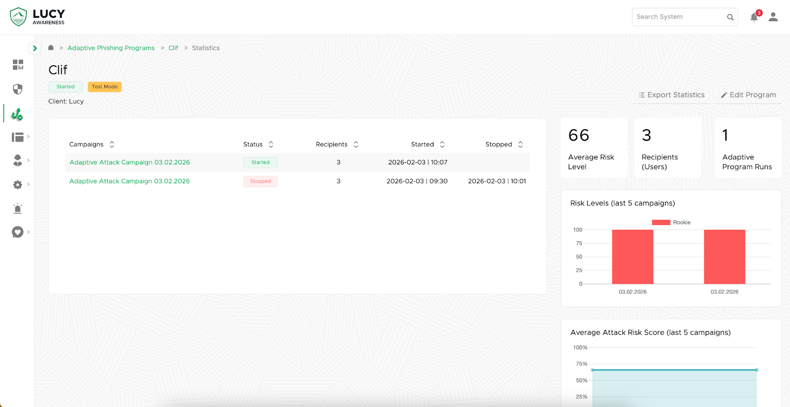

# Adaptive Phishing Programs


Adaptive Phishing Programs are available in Lucy version 5.7 and above.



Adaptive Phishing is currently in Beta and is available by request.

For access to this Beta feature, please contact your account manager.


## Introduction

Adaptive Programs are a new simulation mode that automatically adjusts phishing attack difficulty for each user based on their individual [risk score](users/risk-score.md). Unlike traditional campaigns that send the same content to all employees at once, an Adaptive Program is a continuous, self-adjusting system that evolves based on real-time user behavior.

This feature is designed for organizations that want:

* Difficulty progression based on user behavior
* Reduced administrative overhead
* More accurate measurement of user risk over time

#### The Assess-Learn-Adapt Cycle

The system functions as an automated loop that minimizes manual intervention while maximizing training effectiveness:

* **Behavioral Tracking:** The system monitors how each user interacts with simulated threats.
* **Risk Scoring:** Based on these interactions, the system calculates and updates a unique [risk score](users/risk-score.md) for every user.
* **Dynamic Assignment:** Users are automatically categorized (e.g., Rookie, Advanced, or Expert) and assigned phishing scenarios tailored to their specific skill level.
* **Automated Iteration**: The system schedules and launches new campaigns indefinitely, learning from the results of one campaign to optimize the next.

## Getting Started

To create an adaptive campaign navigate to **Phishing Programs** and then select **+ New Program:**

<figure><figcaption></figcaption></figure>

Give the program a name and a [client](settings/clients/), then select **Create**.

<figure><figcaption></figcaption></figure>


Test Mode enables smaller frequency options and limits recipients to 10 for safe testing.


## Configuration

Just like standard campaigns, Adaptive Programs have an initial configuration that must be completed first.&#x20;

### Base Settings

The [base settings](campaigns/campaign-settings/configuration/base-settings.md) are the same as any other campaign with one new setting, **Run Frequency**.

<figure><figcaption></figcaption></figure>

This setting controls the length of each individual scenario within the program. In the screenshot above, every scenario will run for 2 weeks. At the end of this timeframe, the program will re-calculate the risk score for each user and randomly assign them a new scenario according to their new score.


Click **Save** to apply your changes and select **Finalize Step** when you're ready to move on.


### Attack Simulation

In a standard campaign you can add one or more attack scenarios to your campaign, and the same is true of an adaptive program.

The difference is that Adaptive Programs use your configured [Risk Scores](users/risk-score.md) automatically. For each Range (Rookie, Advanced, Expert, etc.) you can add one or more attack scenarios that your Adaptive Program will use when randomly assigning scenarios.

Adding and configuring a scenario works just like in a [standard campaign](campaigns/campaign-settings/main-settings/attack-simulation/attack-templates.md).

<figure><figcaption></figcaption></figure>


Users will not receive a scenario they've already received unless they've exhausted all scenarios in their level. To ensure a broad and non-repetitive learning experience, it is recommended to add at least 3–4 scenarios per risk level.



Select **Finalize Step** when you're ready to move on.


### Recipients

Unlike in standard campaigns, recipients in an Adaptive Program do not need to be bound to any scenarios. The program will automatically use the Risk Score of each recipient to send them the appropriate scenario, and when that scenario is finished the program will update their scores and do it again!


Select **Finalize Step** when you're ready to move on.


## Starting a Program

Select **Start** to initiate the campaign checks and start your program.

The program must run the checks for each scenario, so give it time to finish and don't navigate away from the page while the checks are in-progress.


Programs cannot be edited once started, so double-check your settings!


## Program Dashboard

Once you've finalized each step you'll be taken to the program's dashboard view, which looks very similar to the standard campaign view:

<figure><figcaption></figcaption></figure>


Adaptive programs can use the [scheduler](campaigns/campaign-settings/configuration/schedule/), [generate reports](campaigns/campaign-settings/results/reports.md), and use all the other [advanced options](campaigns/campaign-settings/advanced-settings/) of a regular campaign.


### Program Statistics

On the dashboard page you can select **Program Statistics** to see an overview of your program:

<figure><figcaption></figcaption></figure>

<figure><figcaption></figcaption></figure>

This view will again look familiar, with a few new additions:

* **Export Statistics**: Select this to go to the [Statistics Dashboard](statistics-dashboard.md) where you can filter by Adaptive Programs and then generate a report.
* **Edit Program**: Select this to go back to the program dashboard.
* **Average Risk Level**: The current mean risk score across all participating users.
* **Recipients (Users)**: The total number of unique users enrolled in the program.
* **Adaptive Program Runs**: A counter showing how many times the system has automatically executed a new campaign cycle.
* **Risk Levels**: This bar chart categorizes users by their risk tier (Rookie, Advanced, or Expert) for each of the most recent campaign runs.
*   **Average Attack Risk Score**: This line graph tracks the fluctuation of the average risk score across your last five campaign cycles.&#x20;

