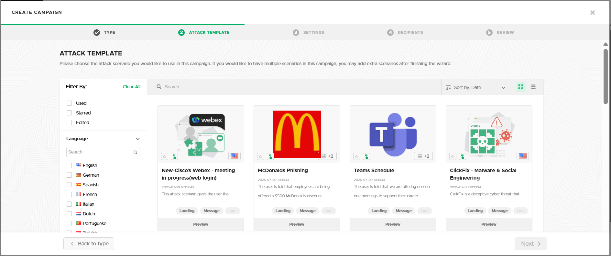

# Selecting an Attack

## Select a Template

Select an Attack template that closely resembles your simulation goal.

<figure><figcaption></figcaption></figure>

## Previewing the Landing Page


**Select a template > Preview > Landing > Select a language**


<figure><figcaption></figcaption></figure>

This will open a new tab in your browser to allow you to dynamically test the functionality of the template.

<figure><figcaption></figcaption></figure>

## Previewing the Email Message

Similarly, you can also preview the email message

<figure><figcaption></figcaption></figure>

After selecting the Attack template you want to use, click on 'Next'
