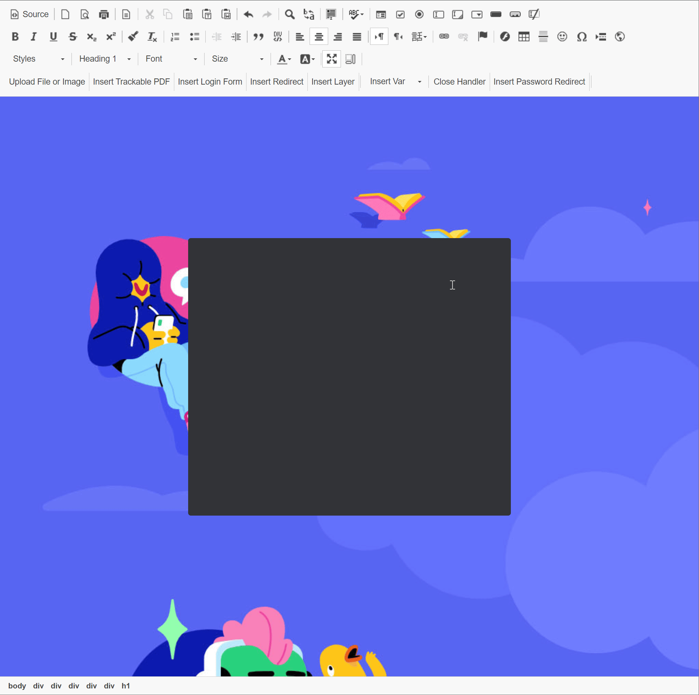
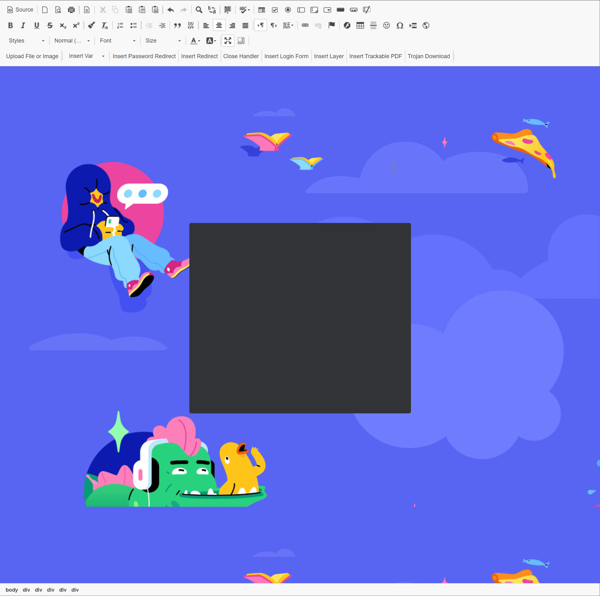
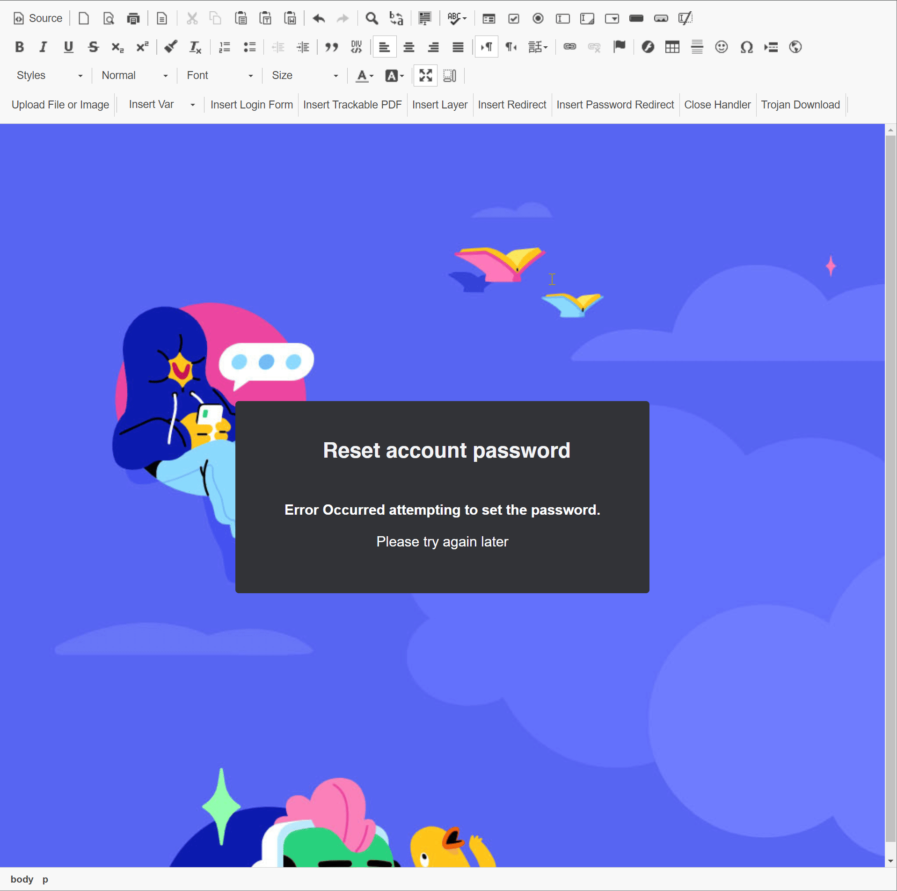
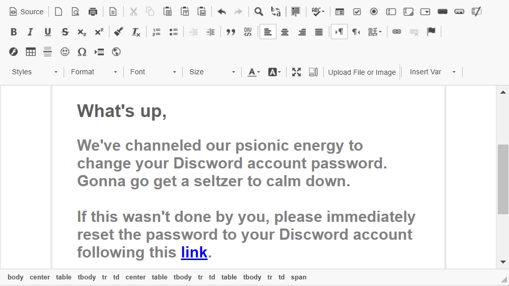
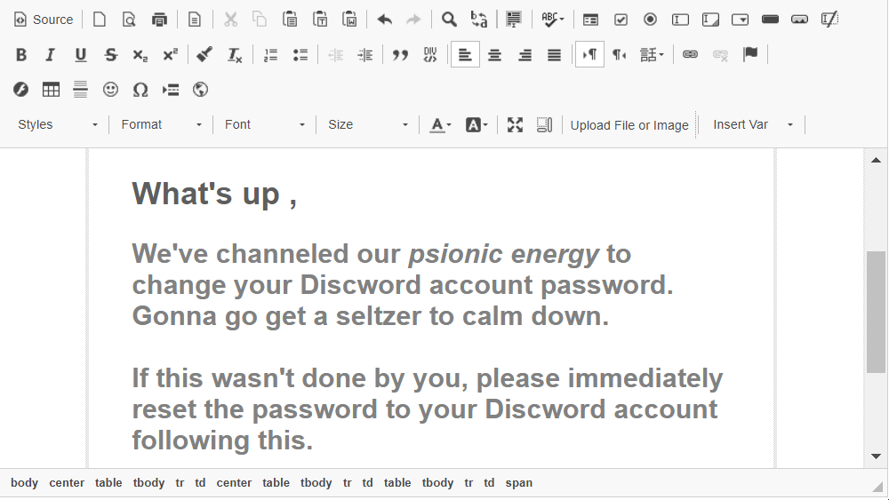

# Attack Settings

The Attack Settings tab lets you attach a default or pre-configured attack template to your campaign.

***

### Add an Attack Template to your campaign

Select "New Scenario"

<figure><figcaption></figcaption></figure>

This displays the Attack Template Gallery.

<figure><figcaption></figcaption></figure>


Use filters to find the correct attack template. For guidance on navigating the Attack Template Gallery, [see our related article.](../../../templates/attack-templates.md)


Search for your desired Attack Template, select "Use Template," and specify the default language.

<figure><figcaption></figcaption></figure>


You can dynamically preview templates. For further instructions, see our [reference article](../../../templates/attack-templates.md#filtering).


***

### Attack Template Base Settings

The base settings of the attack template provide an opportunity to define key parameters regarding the template's behavior.

<figure><figcaption></figcaption></figure>



**Template**

By default, the original template name will be populated as a direct link to the template location on your server.

**Name**\
\
Provide a suitable name for your attack scenario in the context of this campaign.&#x20;



The domain dropdown allows you to select either a [pre-registered](../../../settings/common-system-settings/domains/) attack domain or a domain added to the server that is under your organization's control.

The Sub-domain section lets you define a second-level domain name, such as "access" in **access**.your-attack-domain.com.


Avoid using your System Domain for phishing simulations to prevent potential blacklisting issues. - See our reference article on [Domains](../../../settings/common-system-settings/domains/) for more information.




In the scenario base settings, you can select a URL-shortening service from the dropdown menu. This feature is available only for domain names, not IPs.


URL-shortening services may scan the links, leading to inaccurate statistics. To avoid this, use the Antivirus/Firewall Protection Interval option available in the campaign's [Base settings](base-settings.md#antivirus-firewall-protection-interval).




The statistic for recipients opening the email is based on a tracking image embedded within the email. However, many email clients block the automatic download of images, which can make this number less accurate.


Please refer to our Guide on [Email Tracking Technologies](../../../../guides/attack-simulations/email-tracking-technologies.md) for more information.




Lucy provides a suite of features designed to enhance your understanding of user behavior and system security when interacting with simulated phishing tests. Each option delves into different aspects of the recipient's environment, from browser configurations to network connections, offering valuable insights for cybersecurity awareness and training.


Please refer to our detailed Guide on [Advanced Information Gathering](../../../../guides/attack-simulations/advanced-information-gathering.md) for more information.


1. **Browser Details:** This tracks specific details about the browser the recipient is using, such as the browser type, version, and any associated browser extensions. Understanding the browser details can help identify potential security weaknesses or confirm if the browser is up-to-date and configured with security best practices.
2. **Firebug Information:** Firebug is a popular web development tool. If a user has Firebug installed, it could potentially be used to debug or modify webpages. Tracking whether Firebug or similar tools are present can reveal if there's an increased risk of web-based threats or attacks.
3. **Popup Blocker:** This checks if the user’s browser is configured to block popup windows. Popups are often used in phishing attacks to deliver malicious content, so knowing whether popup blockers are active can be indicative of the user's level of vulnerability.
4. **Geo Location:** By determining the geographic location of the user, the organization can assess if there are access patterns from unusual locations that could indicate compromised credentials or other security issues.
5. **Social Network:** This feature checks for active connections to social networks from the user’s browser. Given that social networks can be platforms for phishing and malware distribution, awareness of such activity can be crucial for understanding the social media risk landscape.
6. **Proxy:** Identifying whether the user is connected to the internet via a proxy can be important for security. Proxy usage can obscure the true IP address, which could either be a legitimate privacy measure or a method to hide malicious activity.



**Send link to Awareness Website Automatically via Email:**

This feature dispatches a link to the Awareness Website to a user immediately after they've fallen for a simulated attack. For this functionality to operate correctly, the Awareness Website must be active and published.&#x20;

\
**Send Awareness By Click Rate:** This feature allows you to set a threshold for historical click rate that triggers the sending of an awareness email. For instance, setting it at 50% means a user will receive an awareness email only if they have clicked on at least half of the links presented in previous phishing simulations.

**Send Awareness By Success Rate:** Similarly, the success rate determines the rollout of awareness training but is based on different successful interactions, not just link clicks, to initiate the e-learning process.

**Awareness Delay:**

Within LUCY, you have the option to set a delay for sending the automated awareness email. This delay ensures that individuals within the same office aren't notified simultaneously about the occurrence of a phishing simulation, which can prevent immediate cross-talk and maintain the integrity of the test environment.


Alternatively, users can be automatically [redirected to the Awareness training through their browser](../../../../guides/attack-simulations/redirecting-users.md) immediately after engaging with the simulated attack.




This setting in LUCY determines what is considered a successful attack and subsequently triggers the start of eLearning.&#x20;

There are four options available for defining success actions. Each option specifies the condition under which eLearning is initiated. For instance, if you select "data submit" as the success action, eLearning will only begin once the user enters data and submits it on a landing page.&#x20;


It’s important to note that if you use "data submit" as the success action on a file-based template that doesn’t include a login mechanism, the eLearning will never be initiated for the user.


**Click ->** Success triggered when the user clicks on the link in the email.

**Data Submit ->** Success triggered when the user enters data and submits it on a landing page of the attack.

**File Download ->** Success triggered when the user clicks on the file download button on the landing page.

**File Data Received ->** Success triggered when the user executes the file and Lucy received the dummy data.



Collected data encompasses information gathered from web-based phishing simulations, including credentials entered on a fake login page or data transmitted to LUCY from simulated document macros activated by users.


Refer to our platform reference article on [viewing collected data](../results/statistics.md#collected-data).



Lucy collects only "Partial" or "No" data to comply with data regulations, revealing the first three characters of usernames and passwords.




When employing the Double Barrel Attack, the system initially dispatches a "Lure" email with teaser text. Subsequently, the system pauses for a specified duration before sending the actual phishing email. This advanced strategy involves the "Lure" potentially impersonating a known authority figure within your organization, who then endorses the follow-up attack simulation as bait.

The delay for the "Lure" defines, in seconds, the interval between the "Lure" and attack emails for a Double-Barrel Attack.


Refer to our Guide on [Lure Attacks](../../../../guides/attack-simulations/attack-types/lures.md) for more information.




Another option involves defining login filters to exclusively capture valid logins. For instance, you could specify the domain name in the User Name field or stipulate that passwords must be at least 8 characters long to be accepted by LUCY.

If you wish to validate logins and passwords using regular expressions (via the "Login Regexp" and "Password Regexp" fields in Scenario Settings), please ensure that the login field is named "Login" and the password field is named "Password".


Refer to our Guide on [Regular Expressions in Login Fields](../../../../guides/attack-simulations/regular-expressions-in-login-fields.md).




Click "Save" to commit your changes.

***

### Mail Settings

Administrators have two choices for setting up mail delivery: globally or at the campaign level. Global settings affect all campaigns but can be overridden by campaign-specific settings, which only apply to the selected campaign. This flexibility allows for customized mail delivery preferences on a per-campaign basis:



Navigate to -> [Settings -> Common System Settings -> Mail Settings](attack-settings.md#mail-settings)\
\
Here you can choose your default method for sending emails. This setting will apply to all campaigns.



Lucy incorporates a built-in internal mail server (Postfix) as its default method for email delivery. This approach is straightforward and often used due to its direct integration within Lucy. To enhance delivery success, it's advisable to align the server's name with Lucy's Fully Qualified Domain Name (FQDN), potentially using a subdomain designated for mail purposes.



Lucy allows the configuration of an external SMTP server via its general settings. This is particularly useful when aiming to circumvent spam filters that may block emails from new or untrusted IP addresses. Setting up involves adding your mail server details under "[Settings -> Common System Settings -> SMTP Servers](../../../settings/common-system-settings/smtp-servers.md)"; followed by a connection test to ensure proper setup.



***

### SSL Settings

Lucy features SSL automation that connects to GoDaddy via API to generate wildcard SSL certificates with 90-day validity in just seconds.

<details>

<summary>What is SSL?</summary>

SSL (Secure Sockets Layer) is like a protective shield. It ensures that when your targets interact with the awareness page, their data remains secure and can't be intercepted by prying eyes. It's the trusty guard that makes sure your training stays securely encrypted over the internet.\
\
Without an SSL certificate, your recipients will encounter a big <mark style="color:red;">red</mark> warning page, signaling that the site they're trying to access isn't secure. This could seriously affect the authenticity of your training if it's not properly set up. So, think of SSL as your trusty sidekick, keeping things legitimate, secure and encrypted.

</details>

Select the checkbox to include an "**SSL Certificate**"

<figure><figcaption></figcaption></figure>



Choose this option if you have already generated an SSL certificate on your Lucy server. This option allows you to reuse the existing certificate.


Be advised that the validity period of the existing certificates will not be extended.




This option is ideal if you already have an SSL certificate chain from a trusted certificate authority or if you would like to generate a self-signed certificate.&#x20;


Be aware that self-signed certificates are not issued by trusted certificate authorities. As a result, browsers will mark your domain as not secure when using these certificates.


**Option 1: Generate a self-signed Certificate**

<figure><figcaption></figcaption></figure>

1. **Domain**: Enter the domain name for which you want to generate the SSL certificate (e.g., thrivedx.help).
2. **Email**: Provide a valid email address. This is where Let's Encrypt will send notifications about your certificate, such as renewal reminders.
3. **Details**: Fill in the Country, State, City, Organization Name, and Organizational Unit. These details are often used in the certificate's subject field and can be important for organizational certificates.
4. **Generate**: Click on the "Generate Certificate" button to create your self-signed certificate.

#### Option 2: Upload an Existing Certificate

1. **SSL Certificate**: Click "Choose File" to browse and select your existing certificate file (usually a `.crt` or `.pem` file).
2. **SSL Key**: Click "Choose File" to upload the private key file associated with your SSL certificate (this is a `.key` file and must be kept secure).
3. **SSL Key Password**: If your private key is password-protected, enter the password here.
4. **SSL Chain**: Click "Choose File" to upload the chain file (also known as the CA bundle or intermediate certificate) if required. This is needed for browsers to trust your certificate by establishing a chain of trust to a root certificate.
5. **Wildcard**: If you are uploading a wildcard certificate, you would check the "Wildcard" box. Wildcard certificates secure a domain and all its subdomains (e.g., `*.example.com`).



Our default method, designed for maximum user-friendliness, enables your Lucy server to automatically generate a Certificate Signing Request (CSR) through the integrated Let's Encrypt API. It then submits this request to Let's Encrypt and automatically installs the full certificate chain on your Lucy server.&#x20;

This process may take up to 5 minutes to complete. Please wait for the "certificate successfully generated" notification before proceeding further.


Let's Encrypt certificates are issued with a maximum validity period of 90 days.



Please be aware that Let's Encrypt, a third-party SSL provider, imposes certain limitations. One notable restriction is the issuance cap of no more than 5 certificates per week for the same domain name. For additional details on these limitations, you can visit: [Let's Encrypt Rate Limits](https://letsencrypt.org/docs/rate-limits/).





See our platform reference article "[SSL Settings](../../../settings/common-system-settings/ssl-settings/)" for more information.


***

### Bound Awareness Scenarios

Lucy enhances the effectiveness of educational campaigns by allowing for a targeted approach, focusing on individual user performance across different simulated attack scenarios. This personalized method not only makes the training more relevant but also more engaging for users.

**Scenario-Based Training Customization:**

* **Specific Attack Recognition:** Consider a campaign that includes various types of phishing attacks such as data entry, hyperlink, and file download attacks. Lucy allows you to monitor how each user responds to these different scenarios.
* **Customized Learning Experiences:** If a user fails in one scenario but performs well in others, Lucy enables you to tailor the training specifically to their needs. For example, a user who mistakenly downloads malware thinking it is a legitimate document does not necessarily need a broad phishing course. Instead, they can benefit from a focused session on identifying and avoiding file-based threats.
* **Efficient and Effective Training:** By providing training specific to the user's vulnerabilities, Lucy ensures that the learning is both efficient and directly applicable. This targeted education approach helps in reinforcing the correct practices without overloading the user with unnecessary information.

**Configuration**

Bound Awareness Scenarios can only be configured directly on the **Awareness Scenario**. In your current campaign, navigate to **Configuration -> Awareness Settings -> Select your Awareness Scenario**, then navigate to the tab "**Bound Attack Scenarios**":

<figure><figcaption></figcaption></figure>

Here, you can specifically link each awareness scenario with the corresponding attack simulation that aligns with the training material.

This capability allows you to provide targeted and efficient awareness training that addresses users' specific needs based on their performance in different attack scenarios.

***

### Landing Page Template

The "Landing Page Template" tab in Lucy is a powerful tool for creating and managing phishing simulation landing pages.

**Configuring Your Landing Page**

<figure><figcaption></figcaption></figure>



Restore the template to its default settings before editing.



Uploads your custom landing page.&#x20;

Ensure the webpage is archived in a zip file with all HTML files placed in the root folder. The archive may also include external files and resources, which should be in the same folder as the HTML files or in a sub-folder.

Name your files appropriately:

* `index.html` — Main file of the template and the entry point of your Landing Page.
* `account.html` — The page displayed after a successful login. If your `index.html` includes a login form, set its action attribute to `"?login"` to enable password-capturing mechanisms.



To copy an existing webpage, you can use the "Copy Webpage" button

* **Choose the Source URL**: Enter the URL (e.g., `http://www.example.com`) of the webpage you want to copy.
* **Select the Target File**: Choose the file you wish to replace or overwrite on your server. If you select "index.html," this will overwrite your current index.html file.
* **Start the Copy Process**: Click Start to begin. During the copy, a sand wheel will appear indicating the process is underway. Do not navigate away from the page until the process is complete.
* **Completion Notification**: Once copying is done, a notification will appear briefly.
* **Review the Copied Content**: Return to the Landing Page to view the copied webpage. If you created a new file (like "copy.html"), select that file to view it.


&#x20;If your **`index.html`** includes a login form, set its action attribute to **`"?login"`** to enable password-capturing mechanisms.




* **Language Selection**: Choose the language for your landing page from the dropdown menu to ensure it matches the target audience's language.

<figure><figcaption></figcaption></figure>


Languages are not automatically translated; all adaptations must be applied to each selected language.


* **Editor Type**: Select the type of editor you prefer to use. The default setting is the "Visual Editor", which provides a user-friendly interface for designing web pages.

<figure><figcaption></figcaption></figure>

### **Editing Content**

<figure><figcaption></figcaption></figure>

Lucy's Attack templates will always include two files, **index.html** and **account.html**.


Lucy adheres to a strict naming convention for these files. If you create a custom template, make sure to name the files **`index.html`** and **`account.html`.**


**Index.html**

* **Purpose:** Serves as the initial landing page for the simulated attack. When users click a link in the attack email, they are directed to this page.
* **Function:** Mainly used for credential harvesting, this page typically prompts users to enter login details or other personal information.

**Account.html**

* **Post-Attack Redirection:** After data is submitted on index.html, users are redirected to account.html.
* **Function:** This page facilitates the conclusion of the attack. It may:
  * Automatically redirect users to the associated awareness training in the campaign.
  * Display a fake notification, such as "Your VPN was successfully authenticated."
  * Show a blank page that redirects immediately to awareness training with no delay, following the data exploitation on index.html.


The first page the user accesses should be named **`index.html`**.


<figure><figcaption></figcaption></figure>

### **Content Editing**:

Use the editor toolbar to add or modify text, insert images, and adjust formatting.

<figure><figcaption></figcaption></figure>

<details>

<summary>Landing page Variables</summary>

1.  **%static%** — Path to the static directory, useful for referencing CSS/JS files from the HTML page. For example:

    ```html
    htmlCopy code<link rel="stylesheet" type="text/css" href="%static%/style.css">
    <script src="%static%/script.js"></script>
    ```
2. **%link%** — Base link of the scenario, used in navigation for constructing absolute URLs.
3. **%name%** — Recipient's full name.
4. **%firstname%** — Recipient's first name.
5. **%lastname%** — Recipient's last name.
6. **%email%** — Recipient's email address.
7. **%link-awareness%** — Link to the awareness website. Ensure the awareness website is configured and enabled in campaign settings.
8. **%division%**, **%location%**, **%staff-type%**, **%comment%** — Information related to the recipient.
9. **%gender("MALE ADDRESSING", "FEMALE ADDRESSING", "NO GENDER")%** — Customizable addressing based on the recipient's gender.
10. **%subject%** — Subject of the phishing mail.
11. **%sender%** — Sender's name of the phishing mail.
12. **%sender-email%** — Email address of the phishing mail sender.
13. **%time(FORMAT, OFFSET, ZONE)%** — Time-based variables:
    * **FORMAT** - Date/time format.
    * **OFFSET** - Date/time offset in minutes; can be negative (e.g., "-60" means 60 minutes before mail submission time, "20160" means 14 days after).
    * **ZONE** - Time zone name (e.g., US/Central).
    * Example: `%time("l, H:i", "0", "Europe/Zurich")%` will output "Monday, 09:20" — the exact time of email submission in the Europe/Zurich time zone.
    * Example: `%time("Y/m/d H:i:s", "60")%` will output "2016/12/12 10:20:30" — 1 hour ahead of email submission time.

Please note that these variables are not available in CSS and JavaScript files.

</details>

#### Incorporate dynamic elements:

Login forms&#x20;

<figure><figcaption></figcaption></figure>

Downloadable content

<figure><figcaption></figcaption></figure>


"Trojan Download: is only available for file-based and mixed attacks.


### Editing Account.html

`account.html` can be seen as the conclusion to a successful attack initiated through `index.html`. This page can serve various purposes; by default, it acts as a confirmation of the attack with messages like "Error Occurred attempting to set the password."

<figure><figcaption></figcaption></figure>

Leaving the user on this page without further action could prompt them to contact the IT team, potentially creating an unnecessary bottleneck. To avoid this, Lucy allows you to insert a redirect and specify the delay in milliseconds before the redirect takes effect.

<figure><figcaption></figcaption></figure>

The redirect places a script in the source code with a default redirect time of 5000 milliseconds.

<figure><figcaption></figcaption></figure>

You can change the redirect time by adjusting the millisecond value to eg. 2sec -> **2000**

<figure><figcaption></figcaption></figure>

Finally, you need to specify the destination for the redirect. For instance, you might want to direct the user to your internal Learning Management System (LMS); in this case, you can add a fully qualified domain name.&#x20;

<figure><figcaption></figcaption></figure>

Alternatively, you can use the 'awareness' placeholder variable to redirect the user to the associated awareness training in the campaign.

<figure><figcaption></figcaption></figure>


Editing a template within a campaign should be campaign-specific, indicating that the modifications are exclusive to that campaign and not intended for reuse in future campaigns.


**Preview and Adjustments**

* **Preview**: Utilize the "Preview" button to view how the landing page looks in real-time, allowing for adjustments before deployment.

<figure><figcaption></figcaption></figure>

**Finalizing the Landing Page**

* **Save Changes**: Always remember to save your changes to ensure all modifications are updated and stored correctly.
* **Restore Defaults**: If needed, you can restore the settings to their default state at any stage.

***

### Message Template

This is your opportunity to customize the default email template to match your organization's branding, font, and voice.

**Setting Up the Email**

Choose the language from the "Language" dropdown, e.g., English.


Languages are not automatically translated; all adaptations must be applied to each selected language.


**Email Details**

* Fill in the "Subject" field, e.g., "Your password expired!".
* Enter "Sender Name", e.g., "Discord Notifications".
* Provide "Sender Email", e.g., "no-reply@discword.com".

<figure><figcaption></figcaption></figure>


It's advisable to use a sender domain that is associated with the registered domain of the attack since this domain's DNS records (SPF, MX) are automatically configured to point to your Lucy server. This alignment helps ensure that the emails appear more legitimate and reduces the risk of them being flagged as spam.



**Content Editor**

Choose "Editor Type" from the dropdown to select your preferred email editor.



The Visual Editor is a WYSIWYG interface, offering an easy way for users to create content as it will appear in its final form. With a straightforward toolbar, users can format text and add multimedia without coding knowledge.



The Code Mirror Editor is geared towards users with coding expertise. It provides a code-highlighting text editor for direct HTML and CSS manipulation, offering granular control over the content's appearance and structure.



**Composing the Email**

Use the "Content" section for email composition.

#### Format text with the toolbar options (bold, italic, underline, etc.).

<figure><figcaption></figcaption></figure>

#### Insert dynamic variables into the content.

<figure><figcaption></figcaption></figure>

<details>

<summary>Dynamic Variables Explained</summary>

When creating email templates, you can personalize the content by using various placeholders that will be automatically replaced with specific user data when the email is sent. Below is an explanation of each variable available for use in the templates:

* `%link%`: This variable represents the base URL of your site. Use it to construct absolute URLs for navigation within your emails.
* `%user-password-reset%`: This placeholder is replaced with the unique URL for a password reset action.
* `%user-profile-link%`: Inserts a direct link to the user's profile page in the End User Portal.
* `%user-login-url%`: Provides a link to the End User Portal that utilizes SSO (OAuth 2.0) for login.
* `%name%`: The full name of the email recipient.
* `%firstname%`: The recipient's first name.
* `%lastname%`: The recipient's last name.
* `%email%`: The recipient's email address.
* `%client%`: The name of the client associated with the recipient.
* `%gender("MALE ADDRESSING", "FEMALE ADDRESSING", "NO GENDER")%`: This is a conditional variable that changes the greeting or addressing based on the recipient's gender.
* `%subject%`: The subject line of the phishing email.
* `%sender%`: The name of the sender of the phishing email.
* `%sender-email%`: The email address from which the phishing email is sent.
* `%started%`: The date when the related phishing campaign was started.
* `%stopped%`: The date when the related phishing campaign was stopped.
* `%time(FORMAT, OFFSET, ZONE)%`: A dynamic time variable where:
  * `FORMAT` refers to the format in which the date/time should be displayed.
  * `OFFSET` is the time offset from the mail send time, which can be positive or negative.
  * `ZONE` is the time zone to be applied.
  * Example: `%time("l, H:i", "0", "Europe/Zurich")%` would display the time of the email submission in the Europe/Zurich time zone.
  * Example: `%time("Y/m/d H:i:s", "60")%` would show a timestamp one hour ahead of the email submission time.

Note that these variables are intended for use in the HTML body of the email and are not applicable within CSS and Javascript files. They serve to customize the email content for each recipient and should be used accordingly to ensure a personalized user experience.

</details>

#### &#x20;"Upload File or Image" to add company branding or assets.

<figure><figcaption></figcaption></figure>



Add your own attachments. Keep in mind that most common email clients filter certain types of attachments, like executables, to prevent malware risks.



Set custom SMTP headers to meet specific needs. For example, you can add a custom email header to help your SPAM gateway distinguish between actual SPAM and emails sent from LUCY.



* **Send emails as plain text.**
*   **Random Email**:

    LUCY will generate a random email account with a random sender. The email account will be deleted after the campaign ends.

If you want to catch email replies from your awareness email, LUCY provides two options:

1. **Define a Reply-to Header**:
   * The Reply-to address is where email replies are directed, rather than the 'From' address. This is useful if the 'From' address cannot receive replies, for example, if you do not control the domain or lack a mail server setup for it. For instance, if the email shows as being sent from "mitchel@guysfromrolla.com" and the recipient clicks reply, the email will be directed to the Reply-to address set in the header, such as "[billg@microsoft.com](mailto:billg@microsoft.com)". Choose a Reply-to address you have access to.
2. **Define a Forward Mail**:
   * LUCY can forward incoming replies to a specified email address. This requires setting a [DNS entry (MX record)](../../../settings/common-system-settings/domains/#dns-records-explained) for the sender’s domain that points to LUCY. For example, if you send emails from "attacker@phishing-test.com" and LUCY's IP is 201.35.77.12, you need an MX record like "phishing-test.com MX 10 201.35.77.12". Enter your own custom mail address in the forward mail field (e.g., "user@example.com"). When someone replies to "attacker@phishing-test.com", LUCY receives the email and forwards it to "user@example.com". Note that many registration services offer free mail/DNS packages, allowing you to set up an email forwarder directly at the domain level, eliminating the need for LUCY’s forwarding feature.



**DKIM Overview:**&#x20;

DomainKeys Identified Mail (DKIM) enhances email security by attaching a domain name identifier to a message, utilizing cryptographic techniques to validate authorization. This identifier is separate from other message identifiers such as the author's "From" field. DKIM effectively 'signs' emails to verify their origin, helping to identify and prevent spoofed emails. The process involves the sending mail server signing the email with a private key, while the receiving server uses a public key listed in the domain's DNS to verify the signature. Each domain can list multiple DKIM keys in its DNS, but each private key is unique to one mail server.

**Setting Up DKIM in LUCY:**

1. **Enable DKIM:**
   * Navigate to "Advanced Email Settings" in the message template of your Attack Scenario. Enable DKIM support and save the changes. A DKIM information box will then appear.
2. **DNS Configuration:**
   * Copy the provided key and create the corresponding DNS entry. Here’s an example of how to set it up with namecheap.com:

```
Name: selector._domainkey
Type: TXT
Value: "v=DKIM1; k=rsa; p=[YOUR_PUBLIC_KEY]"
```

**Validate DKIM Setup:**

* To confirm your DKIM is working, add an email from a service like [dkimvalidator.com](https://dkimvalidator.com/) to your DKIM test recipient group. Launch the campaign targeting this group, then check the results at dkimvalidator.com. If configured correctly, your setup should match the expected status.

**DKIM Header Details:** The DKIM signature is added to emails as an RFC2822 header field. Here's a breakdown of the common fields in a DKIM signature:

* **b:** Digital signature of the email's contents.
* **bh:** Hash of the email body.
* **d:** Signing domain.
* **s:** Selector used for the DKIM signature.
* **a:** Signing algorithm, typically rsa-sha1.
* **c:** Canonicalization algorithm for the header and body.
* **q:** Default query method, usually DNS.
* **t:** Timestamp of when the email was signed.
* **x:** Expiry time of the signature.
* **h:** List of header fields that were signed.

This setup ensures that emails sent through LUCY's mail server are authenticated, boosting trust and security for your email campaigns.



***

