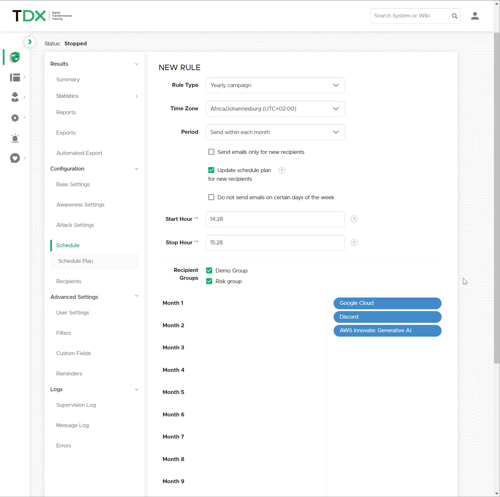

# Schedule

## Introduction

The **Scheduler** in Lucy allows you to create advanced, time-based phishing and awareness campaigns that mimic real-world scenarios. It helps control email delivery rates, avoiding issues with recipient mail servers that may block or delay large batches of emails.

The Scheduler enables you to:

* Define specific rules for sending emails to targeted groups.
* Control delivery timing across days, hours, and even months.
* Ensure new recipients are automatically integrated into long-running campaigns

## Add Rule

The Scheduler is driven by **Rules**, and each Rule is defined by a **Rule Type**. The Rule Type determines how and when emails are sent, and what configuration options are available.

<figure><figcaption></figcaption></figure>

***

## Configuration

The logic for the Scheduler is structured as follows:&#x20;


The Scheduler is governed by its Rules, and these Rules are governed by the Rule Type.


The Rule Type dictates the parameters that can be configured, determining the conditions and actions that the Scheduler can execute.

#### **Rule Type**

The base parameter that will define the rule's core objectives.

<figure><figcaption></figcaption></figure>



Sends a single batch of emails at a specified time.

**Use Cases:**

* Immediate phishing simulations.
* Policy rollouts or training reminders.
* Incident-based awareness campaigns.



Sends emails at a defined interval (e.g., daily, weekly). Recipients receive one email per cycle from selected scenarios.

**Email Distribution Options:**

* **Uniform:** Each recipient gets the same email each cycle.
* **Randomized:** Recipients receive different emails each cycle.

**Additional Parameters:**

* **Repeat Interval:** Frequency (daily, weekly, monthly).
* **Repeats:** How many times to repeat.
* **Start/Stop Hour:** Time window for daily delivery.
* **Run Days:** Specific days to send emails (for weekly/monthly intervals).

**Best For:** Long-term simulations where message randomization prevents internal warnings among employees.



Runs a structured campaign across 12 months, ideal for onboarding or long-term education.

**How It Works:**

* Recipients are automatically enrolled.
* Campaign starts the _month after_ the rule is created.
* Email delivery timing within each month can be customized.

**Monthly Scheduling Options:**

* **Entire Month:** Randomly throughout.
* **Start of Month:** 1st–9th.
* **Middle of Month:** 10th–20th.
* **End of Month:** 21st–last day.

**Visual Planner:** Drag and drop attack/awareness scenarios to each month in the yearly timeline.

<figure><figcaption></figcaption></figure>



***

#### **Email Type**


Applies to: **One-Shot, Repeating**


Specifies the nature of the emails to be sent.

<figure><figcaption></figcaption></figure>

* **All:** Includes all types of emails.
* **Lure:** Emails designed to entice recipients into a phishing simulation.
* **Attack:** Emails that simulate a cyber attack.
* **Awareness:** Emails designed to educate recipients on security awareness.

***

#### **Time Zone**


Applicable to: **All Rule Types**


Set the time zone for your campaign to ensure emails arrive during local business hours, increasing engagement.

<figure><figcaption></figcaption></figure>

***

#### **Start Date / Stop Date**


Applies to: **One-Shot, Repeating**


* **Start Date** _(One-Shot, Repeating)_: Define when the campaign begins (e.g., `19.05.2024 11:10`).
* **Stop Date** _(One-Shot only)_: Define when the campaign ends (e.g., `19.05.2024 12:10`).


Use the **Schedule Calculator** to fine-tune these dates.


Schedule Calculator Explained

The "Schedule Calculator" is a valuable tool for Administrators to define the sending rate of emails in a campaign, particularly important when sending hundreds of simulated emails which can potentially overload receiving mail servers.&#x20;

This feature allows for setting a delay in the sending rate to prevent overloading of servers and to ensure compliance with mail-sending rate policies. For instance, for O365-based (receiving) mail servers, a recommended sending rate from Lucy is no more than 30 emails per minute. This adjustment helps ensure that your emails sent from Lucy are delivered efficiently without triggering spam filters or blocking by receiving mail servers.

***

### **Update Schedule Plan for New Recipients**


Applies to: **All rule types**


<figure><figcaption></figcaption></figure>

Automatically update the schedule plan for new recipients added to the group—even after campaign launch.

**Use Case:** Onboarding new hires from LDAP or Entra ID syncs.

***

### **Do Not Send Emails on Certain Days of the Week**


Applies to: **All rule types**


Prevent emails from being sent on specific days (e.g., weekends).

**Example:** Uncheck Saturday and Sunday to reflect typical business communication patterns.

<figure><figcaption></figcaption></figure>

***

### **Sort Type**


Applies to: **One-Shot, Repeating**


Controls how emails are ordered during delivery.

| Type             | Description                             |
| ---------------- | --------------------------------------- |
| **By Recipient** | Emails sent in completely random order. |
| **By Scenario**  | Emails sent by scenario group.          |

***

### Scenario & Recipient Selection

* **Scenarios:** Select the phishing or awareness scenarios for this rule.
* **Recipient Groups:** Choose which users will receive these emails.

***

### Save Your Rule

Once all configurations are complete, click **“Save”** to build a **Schedule Plan** based on your rule.
