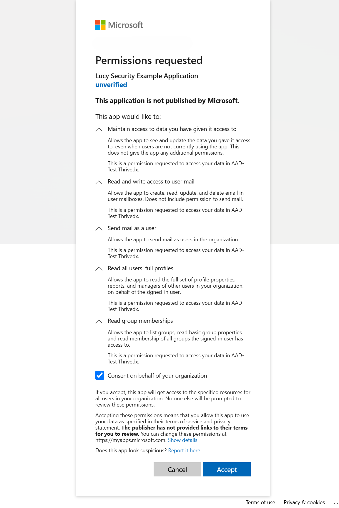

# Azure Applications

### Introduction

Lucy offers the capability to integrate with Azure for importing users, distribute awareness training via SMTP, and implement the Microsoft Graph API XML reporting plugin. Administrators can synchronize several Azure applications, organized by client, to ensure applications are accessible solely to administrative users associated with the respective client.


Navigate to Settings -> Common System Settings -> Azure Applications


### Creating an application in Azure

See here for a guide on setting up an application in Entra ID:\
[https://learn.microsoft.com/en-us/entra/identity-platform/quickstart-register-app](https://learn.microsoft.com/en-us/entra/identity-platform/quickstart-register-app)

### Add an application to Lucy

On this page you can view, add, and delete Azure applications in Lucy.

<figure><figcaption></figcaption></figure>

To add an application, select **+ Add Application**. \
On the page that follows, fill out the application details:

<figure><figcaption></figcaption></figure>



This is the Lucy client associated with the Azure app registration. Lucy ensures data segregation on a client basis, meaning that all data is containerized within the respective client. This setup guarantees that the app integration remains accessible solely to administrative users for the specified client. Moreover, it enables Managed Security Service Providers (MSSPs) and Partners to integrate multiple Azure tenants for their respective clients, further enhancing security and customization.



Give your App registration a friendly name so you can recognize it elsewhere in Lucy.



Once your app is registered copy the Client ID, Secret, and Tenant ID into the corresponding fields.



After configuring all the parameters mentioned above, proceed by clicking "Save". After saving the application, a new button will appear labeled "Authorize". Click this button to grant the required permissions to your Azure application.

This action will redirect you to the Microsoft authentication page, where you will be asked to provide consent on behalf of your organization. This consent is necessary to establish the connection between Lucy and Azure.

<figure><figcaption></figcaption></figure>


To integrate Lucy with your Azure App Registration, it's essential to have Global Azure Administrative consent for your organization. If the administrator account in Lucy lacks the necessary privileges to grant consent on behalf of the organization, refer to the guide provided below to establish a consent flow in Azure.


Setup Admin Consent flow in Azure

### Purpose

The integration of third-party applications like Lucy with Azure requires careful configuration to ensure API permissions are correctly set. This is crucial for applications such as Lucy demanding access beyond the Azure permission set of the Lucy administrative users. A common challenge faced during integration is a permissions mismatch, leading to integration errors. This guide aims to navigate administrators through the consent framework in Azure, enabling Lucy to receive the necessary permissions while upholding the security and integrity of the Azure environment.

### **Who Should Use This Guide?**

This guide is intended for Lucy Administrators who lack Azure Administrative privileges to grant organizational consent, as well as situations where Lucy servers operate without an Azure Administrator to facilitate the saving of Azure application configurations within Lucy.\
\
Lack of Administrative consent  is evident if the following message is displayed after saving your application in Lucy:\
\
.png>)

### Configuration

#### Accessing Azure

1. **Log into the Azure Portal**: Start by visiting [portal.azure.com](https://portal.azure.com/) and logging in with your credentials.

#### Setting Up Consent Flow

2. **Navigate to Microsoft Entra ID**: Find and select the Microsoft Entra ID option to proceed.
3. **Enterprise Applications**: In the Microsoft Entra ID section, locate and click on “Enterprise Applications.”
4.  **Consent and Permissions**: Inside Enterprise Applications settings, select “Consent and Permissions.”\
    \

    <figure><figcaption></figcaption></figure>
5. **Admin Consent Settings**: Search for “Admin consent settings” and click it to modify the consent flow settings.
6. **Enable Consent Requests**: Activate the option “Users can request admin consent to apps they are unable to consent to” by toggling it to “Yes.” This allows non-admin users to request admin consent for applications.
7.  **Designate Reviewers**: Specify Azure Administrative users for the consent review process, selecting your Azure Admin under Review Type as Users.\
    \

    <figure><figcaption></figcaption></figure>
8. **Save Your Settings**: Click “Save” to apply the changes.

#### Finalizing Configuration in Lucy

9. **Adjustments in Lucy**: Instruct the Lucy admin to try saving the application configuration again, preferably using an incognito window to avoid caching issues.
10. **Consent Request Initiation**: The Lucy admin will see a consent request dialog, allowing them to submit a consent request to the Azure Admin.

#### Consent Approval Process

11. **Initiating Approval**: The Lucy admin clicks “Request Approval” to start the consent process.\

    <figure><figcaption></figcaption></figure>
12. **Notification to Administrator**: An approval request is sent to the Azure Administrator's email, and the request appears under Enterprise Applications -> Admin Consent Requests in the Azure portal.\
    \

    <figure><figcaption></figcaption></figure>
13. **Admin Review and Consent Granting**: The Azure Administrator reviews the request in the portal and grants consent on behalf of the organization.\
    \

    <figure><figcaption></figcaption></figure>

    \

    <figure><figcaption></figcaption></figure>

14. **Confirmation to Lucy Admin**: The Azure Administrator should inform the Lucy admin of the consent approval.

#### Completing Integration

15. **Finalizing in Lucy Settings**: The Lucy admin goes to Common System Settings -> Azure Applications in Lucy, selects the application, and clicks “Save” to proceed with the integration.
16. **Microsoft Login and Token Allocation**: This prompts the Lucy admin to log in with Microsoft credentials again to generate a refresh token for the integration.
17. **Binding to Lucy Server**: Successfully obtaining the refresh token completes the integration, effectively binding the Azure app registration to the Lucy server.

### What API permissions are required for this integration?


Lucy is configured to utilize the Microsoft Graph API to access and manage various resources from Microsoft services. The configured permissions include both delegated permissions, which act on behalf of a user, and those requiring administrative consent to access specific types of data, like directory data and full user profiles. These permissions are in line with the version 1.0 standard of the Microsoft Graph API.


<figure><figcaption></figcaption></figure>

#### API Permissions explained



<table><thead><tr><th width="236">Permission</th><th>Type</th><th>Description</th><th>Admin consent?</th></tr></thead><tbody><tr><td>OpenID</td><td>Delegated</td><td>Sign users in</td><td>No</td></tr><tr><td>offline_access</td><td>Delegated</td><td>Maintain access to data after granting access</td><td>No</td></tr><tr><td>email</td><td>Delegated</td><td>View user's email address</td><td>No</td></tr><tr><td>User.Read.All</td><td>Delegated</td><td>Read all users' full profiles</td><td>Yes</td></tr><tr><td>GroupMember.Read.All</td><td>Delegated</td><td>Read group memberships</td><td>Yes</td></tr></tbody></table>




<table><thead><tr><th width="236">Permission</th><th>Type</th><th>Description</th><th>Admin consent?</th></tr></thead><tbody><tr><td>Mail.ReadWrite</td><td>Delegated</td><td>Create, read, update, and delete email in user mailboxes.</td><td>No</td></tr><tr><td>User.Read</td><td>Delegated</td><td>Read the profile of signed-in users. Read basic company information of signed-in users</td><td>No</td></tr><tr><td>Mail.Send</td><td>Delegated</td><td>Send mail as users in the organization.</td><td>No</td></tr></tbody></table>




<table><thead><tr><th width="236">Permission</th><th>Type</th><th>Description</th><th>Admin consent?</th></tr></thead><tbody><tr><td>OpenID</td><td>Delegated</td><td>Sign users in</td><td>No</td></tr><tr><td>offline_access</td><td>Delegated</td><td>Maintain access to data after granting access</td><td>No</td></tr><tr><td>email</td><td>Delegated</td><td>View user's email address</td><td>No</td></tr><tr><td>User.Read.All</td><td>Delegated</td><td>Read all users' full profiles</td><td>Yes</td></tr><tr><td>GroupMember.Read.All</td><td>Delegated</td><td>Read group memberships</td><td>Yes</td></tr></tbody></table>




For a complete explanation of MS Graph permissions [see their documentation](https://learn.microsoft.com/en-us/graph/permissions-reference).

