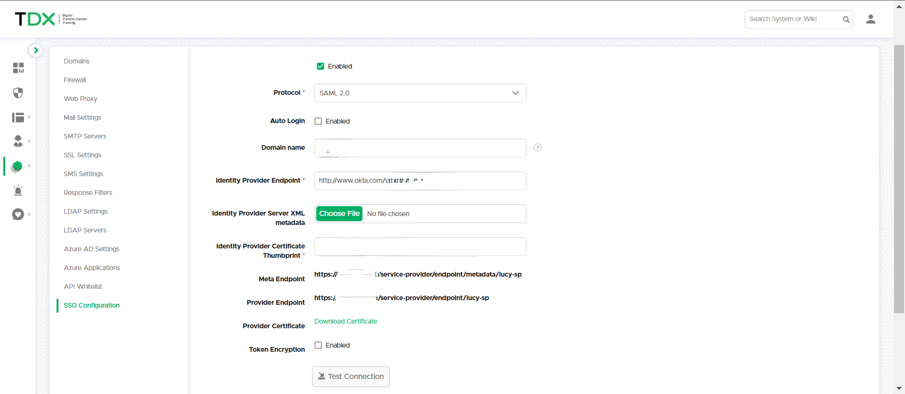

# SSO Configuration

Introduction

Lucy supports single sign-on for both Administrative and End-users through SSO/SAML. SAML (Security Assertion Markup Language) and OAuth 2.0 (Open Authorization) are widely recognized standards for authentication and authorization, each facilitating the implementation of SSO.&#x20;

These technologies allow administrators/users to access Lucy using a single set of credentials, enhancing both user convenience and security. Although SAML and OAuth 2.0 aim to streamline authentication processes, they differ in their specific purposes and operational approaches:



* **Purpose**: OAuth 2.0 is a framework for authorization. It enables applications to obtain limited access to user accounts on an HTTP service. While OAuth can be used for authentication (and often is, with extensions like OpenID Connect), its primary role is to authorize third-party applications to access a user's account without exposing their password.
* **How it works**: OAuth 2.0 uses access tokens rather than user credentials to authorize requests. When a user logs into an application and consents to give it access to another service, the application receives an access token. This token is then used for subsequent requests to the service on behalf of the user.
* **Use Case**: OAuth 2.0 is used in scenarios where an application needs to perform actions on behalf of a user without knowing their password.



* **Purpose**: SAML is primarily used for authentication in SSO processes. It allows secure domains to exchange user authentication and authorization data. SAML is focused on authenticating users and conveying that authentication status to service providers.
* **How it works**: In a SAML SSO flow, when a user attempts to access a service provider (SP), they are redirected to an identity provider (IdP) to authenticate. Upon successful authentication, the IdP sends a SAML assertion (an XML document) back to the SP. This assertion contains the authentication statement and possibly attributes about the user. The SP then grants access based on this assertion.
* **Use Case**: SAML is widely used in enterprise applications and services, especially where the interaction is between a browser and web applications.



## Configuration

Before connecting to the Identity Provider, the following preparations are necessary:

1. **SSL Certificate**: Upload or create an [SSL certificate](ssl-settings/) for the Lucy Admin console. This step is crucial for ensuring that the connection and data exchanged between Lucy and Azure AD are secure.
2. **Administrator Account Matching**: Verify that you have an Administrator account in Lucy, which you can find under Settings -> Users -> Administrative Users. The email address associated with this account must match the email address of your account in the Identity Provider.&#x20;


Please ensure to test the authentication via SSO before enabling the **Auto Login** feature.\
\
If Auto Login was activated and you are locked out of your Lucy server, please reach out to our [technical support department](../../../when-to-contact-us/contact-technical-support.md) for assistance with disabling the Auto Login feature.



Navigate to Settings -> Common System Settings -> SSO Settings


## OAuth 2.0 (Entra ID)

### App Registration

Ensure you have created the App Registration in Entra ID as outlined [here](azure-applications.md).

### Connect to Lucy

Add your Client ID, Client Secret, and Tenant ID from your Azure Entra ID application.

<figure><figcaption></figcaption></figure>


To integrate Lucy with your App Registration, it's essential to have global administrative consent for your organization. If the administrator account in Lucy lacks the necessary privileges to grant consent on behalf of the organization, refer to the guide provided below to establish a consent flow in Azure.


<details>

<summary>Setup Admin Consent flow in Azure</summary>

### Purpose

The integration of third-party applications like Lucy with Azure requires careful configuration to ensure API permissions are correctly set. This is crucial for applications such as Lucy demanding access beyond the Azure permission set of the Lucy administrative users. A common challenge faced during integration is a permissions mismatch, leading to integration errors. This guide aims to navigate administrators through the consent framework in Azure, enabling Lucy to receive the necessary permissions while upholding the security and integrity of the Azure environment.

### **Who Should Use This Guide?**

This guide is intended for Lucy Administrators who lack Azure Administrative privileges to grant organizational consent, as well as situations where Lucy servers operate without an Azure Administrator to facilitate the saving of Azure application configurations within Lucy.\
\
Lack of Administrative consent  is evident if the following message is displayed after saving your application in Lucy:\
\
.png>)

### Configuration

#### Accessing Azure

1. **Log into the Azure Portal**: Start by visiting [portal.azure.com](https://portal.azure.com/) and logging in with your credentials.

#### Setting Up Consent Flow

2. **Navigate to Microsoft Entra ID**: Find and select the Microsoft Entra ID option to proceed.
3. **Enterprise Applications**: In the Microsoft Entra ID section, locate and click on “Enterprise Applications.”
4.  **Consent and Permissions**: Inside Enterprise Applications settings, select “Consent and Permissions.”\
    \


    <figure><figcaption></figcaption></figure>
5. **Admin Consent Settings**: Search for “Admin consent settings” and click it to modify the consent flow settings.
6. **Enable Consent Requests**: Activate the option “Users can request admin consent to apps they are unable to consent to” by toggling it to “Yes.” This allows non-admin users to request admin consent for applications.
7.  **Designate Reviewers**: Specify Azure Administrative users for the consent review process, selecting your Azure Admin under Review Type as Users.\
    \


    <figure><figcaption></figcaption></figure>
8. **Save Your Settings**: Click “Save” to apply the changes.

#### Finalizing Configuration in Lucy

9. **Adjustments in Lucy**: Instruct the Lucy admin to try saving the application configuration again, preferably using an incognito window to avoid caching issues.
10. **Consent Request Initiation**: The Lucy admin will see a consent request dialog, allowing them to submit a consent request to the Azure Admin.

#### Consent Approval Process

11. **Initiating Approval**: The Lucy admin clicks “Request Approval” to start the consent process.\


    <figure><figcaption></figcaption></figure>
12. **Notification to Administrator**: An approval request is sent to the Azure Administrator's email, and the request appears under Enterprise Applications -> Admin Consent Requests in the Azure portal.\
    \


    <figure><figcaption></figcaption></figure>
13. **Admin Review and Consent Granting**: The Azure Administrator reviews the request in the portal and grants consent on behalf of the organization.\
    \


    <figure><figcaption></figcaption></figure>

    \


    <figure><figcaption></figcaption></figure>


14. **Confirmation to Lucy Admin**: The Azure Administrator should inform the Lucy admin of the consent approval.

#### Completing Integration

15. **Finalizing in Lucy Settings**: The Lucy admin goes to Common System Settings -> Azure Applications in Lucy, selects the application, and clicks “Save” to proceed with the integration.
16. **Microsoft Login and Token Allocation**: This prompts the Lucy admin to log in with Microsoft credentials again to generate a refresh token for the integration.
17. **Binding to Lucy Server**: Successfully obtaining the refresh token completes the integration, effectively binding the Azure app registration to the Lucy server.

</details>

### What API permissions are required for this integration?


Lucy is configured to utilize the Microsoft Graph API to access and manage various resources from Microsoft services. The configured permissions include both delegated permissions, which act on behalf of a user, and those requiring administrative consent to access specific types of data, like directory data and full user profiles. These permissions are in line with the version 1.0 standard of the Microsoft Graph API.


<table><thead><tr><th>Permission</th><th width="124">Type</th><th width="167">Description</th><th>Admin consent required</th></tr></thead><tbody><tr><td>User.read</td><td>Delegated</td><td>Sign in and read user profile</td><td>No</td></tr><tr><td>Directory.Read.All</td><td>Delegated</td><td>Read directory data</td><td>Yes</td></tr><tr><td>email</td><td>Delegated</td><td>View users' email address</td><td>No</td></tr><tr><td>offline_access</td><td>Delegated</td><td>Maintain access to data you have given it access to</td><td>No</td></tr><tr><td>OpenID</td><td>Delegated</td><td>Sign users in</td><td>No</td></tr><tr><td>User.Read.All</td><td>Delegated</td><td>Read all users' full profiles</td><td>Yes</td></tr></tbody></table>

## SAML 2.0 (Any)

The exact method of deploying a SAML application for SSO will vary depending on the application your organization uses. These are the general steps for deploying a SAML app and connecting with Lucy.

### **Configure the IdP**

Define Lucy as a SP within the IdP, specifying its endpoint and required SAML attributes.

### **Upload IdP Metadata**

In Lucy, navigate to **Settings -> Common System Settings -> SSO Settings**.

<figure><figcaption></figcaption></figure>

Enter your administrative domain and IdP endpoint.

Then, upload your IdP metadata file and paste in the thumbprint. Your IdP should provide a thumbprint for your X.509 certificate, but you can also use an online tool like [https://www.samltool.com/fingerprint.php](https://www.samltool.com/fingerprint.php).


Lucy requires a SHA1 thumbprint. SHA256 or other algorithms will not work.


### **Attribute Mapping**

Map user attributes from the IdP to fields in Lucy (e.g., email, full name) as required.

### **Test Authentication**

Verify the SSO connection with the IdP by clicking **Test Connection**.\
Testing should be completed before enabling Auto Login to avoid login issues.

#### **Enable Automatic Login (optional)**

This setting allows seamless login but should be used carefully, as enabling it can restrict alternative access methods. [Contact Lucy support](../../../when-to-contact-us/contact-technical-support.md) if auto login prevents access.

## SAML 2.0 (Entra ID)

Microsoft Entra ID also supports SSO using SAML 2.0.

### Create Application

To begin, log in to your Entra ID portal and go to **Manage -> Enterprise Applications**.\
Select **+ New Application** and then select the option for a **Non-gallery** application:

<figure><figcaption></figcaption></figure>

Click **Create** to create the new application.

### App Configuration

Go to **Manage -> Single Sign-On** and select **SAML** for the SSO method.

#### **Basic SAML Configuration**

Click the **Edit** button and enter these values, then **Save**.

**Identifier (Entity ID)**

```
https://<your_lucy_url>/simplesaml/module.php/saml/sp/metadata.php/lucy-sp
```

#### Reply URL (Assertion Consumer Service URL)

```
https://<your_lucy_url>/simplesaml/module.php/saml/sp/saml2-acs.php/lucy-sp
```

#### Attributes and Claims

Click the **Edit** button and then **+ Add new claim**. Create a new claim called **mail** using the attribute **user.mail**, then click **Save**:

<figure><figcaption></figcaption></figure>

### Add Users and Groups

Next go to **Manage -> Users and Groups** and select **+ Add user/group**.

Search for and add your desired Users/Groups so they can use the application to log in to Lucy.

<figure><figcaption></figcaption></figure>


If you don't want to add specific users or groups to the application, go to **Properties** and set **Assignment Required?** to **No**:




### Upload Certificate Data

In the **SAML Certificates** section download the **Federation Metadata XML**.\
In the **Set up \<Application Name>** section, copy the **Microsoft Entra Identifier**.

<figure><figcaption></figcaption></figure>

In Lucy, go to **Settings -> Common System Settings -> SSO Settings**.

1. Select **SAML 2.0** for the method.
2. Enter your Lucy admin domain in the **Domain Name** fiel&#x64;**.**
3. Enter the **Microsoft Entra Identifier** in the **Identity Provider Endpoint** field.
4. Upload the Federation Metadata file in the **Identity Provider Server XML metadata** field.

The **Thumbprint** in Entra ID is created using SHA256. Lucy requires that the thumbprint be SHA1.\
To get the SHA1 thumbprint open the metadata XML file and look for the field labeled `X509Certificate`:

<figure><figcaption></figcaption></figure>

Copy only the text of the certificate and create a new file with this format (you can copy this text):

```
-----BEGIN CERTIFICATE-----
paste your certificate content here
-----END CERTIFICATE-----
```

Save this as a `.pem` file, then use an [online tool](https://www.samltool.com/fingerprint.php) or the `openssl` command to get the SHA1 thumbprint:

```
openssl x509 -in your_certificate.pem -noout -fingerprint -sha1
```

Finally, paste the thumbprint in the **Identity Provider Certificate Thumbprint** field.

<figure><figcaption></figcaption></figure>

Click **Save** to apply the settings, then click **Test Connection**. You should be redirected to your SSO login page where you can test that your connection is working.
