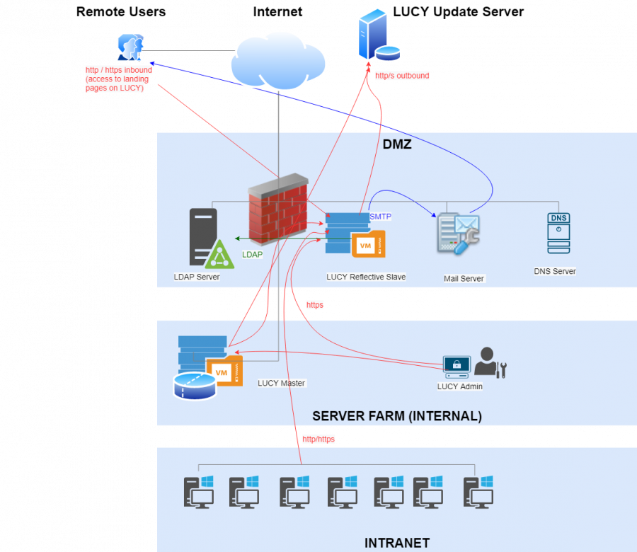

# Web Proxy

### Overview

Implementing LUCY within your organization's infrastructure involves careful consideration of security, particularly in preventing unauthorized internet access to phishing simulations on your intranet. To mitigate risks, especially in scenarios where the server might be compromised, it's critical to ensure that the web service accessible from the internet is segregated from the internal network. This is achieved by placing it in a Demilitarized Zone (DMZ), thereby enhancing security.\
\
A single Lucy deployment will have the following architecture:

<figure><figcaption></figcaption></figure>

### What is a Master/Slave Configuration?

LUCY's master/slave setup facilitates this segregation by assigning a "slave" role to a LUCY instance, serving various purposes:

* **Master/Slave (Proxy Mode):** In this mode, LUCY functions as a reverse proxy, directing all HTTP/S requests to the master without analyzing the traffic, except for the `/admin` section. This setup allows access to the proxy's admin panel, forwarding other requests to the master. The master instance handles all campaign configurations and communications, while the slave serves as a pass-through and data collector. Upon campaign completion, data on the slave is erased.
* **Reflective Master/Slave:** This configuration is designed for campaign management and execution. All campaign details and recipient information are configured on the master, which then pushes this information to the slave for execution. End users interact only with the slave, ensuring that sensitive data and campaign specifics are stored and managed centrally on the master. Email communications in this mode are initiated from the slave.\
  \
  The following diagram is representative of a **Reflective Master/Slave architecture:**

<figure><figcaption></figcaption></figure>

### **Configuration Steps**

To configure the Master/Slave setup in LUCY:

1. Navigate to the "Settings" menu, focusing on "Common System Settings" and "Web Proxy" sections.
2. For external proxy deployment within the DMZ, choose the "proxy" instance type and specify the name of the master LUCY system.

### **Ports and Firewall Configuration**

Both master-slave approaches (reverse proxy and DMZ-based) use only HTTPS port (443). A "recipient" is an end user. For a **proxy**, the firewall configuration would be:

* master should allow connections from slave to port 443
* master should allow connections from slave to port 25 (if the SMTP method selected for the incidents reporting)
* master should allow connections from Lucy admin computers to port 443
* slave should allow connections from "recipients" to ports 443, 80
* master must be able to send emails via port 25

For "**reflective scheme**", the firewall should be configured as follows:

* slave should allow connections from "recipients" to ports 443, 80
* slave should allow connections from master to port 443
* master should allow connections from Lucy admin computers to port 443
* slave must be able to send emails via port 25

### **Integration with Other Services (Master / Slave)**

* **End-User Portal and User Configuration:**
  * Configure the end-user portal and all end-users on the Master server.
  * In Proxy mode, all traffic, except for the Admin console page (`/admin`), is directed to the Master server.
* **SSO and LDAP Settings:**
  * Apply SSO and LDAP settings to the Master server only.
* **Mail Server Configuration:**
  * The mail server operates on the Master server.
  * In Proxy mode, the Slave server intercepts SMTP traffic and forwards it to the Master server.
  * The domain name in the sender's email address must have an MX record pointing to the Slave server.
* **Incident Plugin Settings:**
  * Configure Incident Plugin settings identically on both the Master and Slave servers.
  * The Slave server forwards SMTP and HTTP traffic to the Master server.
  * Incidents are not stored on the Slave server; they are managed and stored on the Master server.

### **Integration with Other Services (Reflective Master / Slave)**

* **End-User Portal and User Configuration:**
  * Configure the end-user portal and all end-users on the Slave server.
  * For the "Do not send emails" option, manually import all end-users to the Slave server.
  * Statistics for each recipient in the End-User portal are available during the campaign. Once the campaign stops, statistics are stored on the Master server only.
* **Campaign Availability:**
  * Only active campaigns are displayed on the End-User portal.
  * To enable users to view their progress and full statistics, provide access to the End-User portal on the Master server.
* **Login and Authentication Settings:**
  * For "Direct Login" and/or "SSO for Awareness" options, configure SSO and LDAP settings on the Slave server.
  * To allow LDAP-based users access to the End-User portal on the Slave server, configure LDAP Settings there.
  * For LDAP-based and SSO users to access the Admin Console on the Slave server, configure both LDAP Settings and SSO Settings appropriately.
* **Mail Server and SMTP Traffic:**
  * The mail server operates on the Slave server.
  * SMTP traffic is intercepted exclusively by the Slave server, with statistics later synchronized with the Master server.
  * Ensure SMTP Settings are identical on both Master and Slave servers.
* **Incident Plugin Settings and Incident Management:**
  * Configure Incident Plugin settings on the Slave server.
  * Incidents are stored on both Master and Slave servers.
  * The Slave server synchronizes each incident with the Master server.

### Additional Considerations

* **SSL Certificates:** Manual transfer of SSL certificates to the proxy may be required, as automatic interactions are not supported.
* **Updates:** Both master and slave require independent updates and should maintain access to LUCY's update/license servers.
* **Domain Configuration:** Ensure that SMTP hostnames and domain names for landing pages and sender emails point to the correct server (master or slave) based on your setup.
