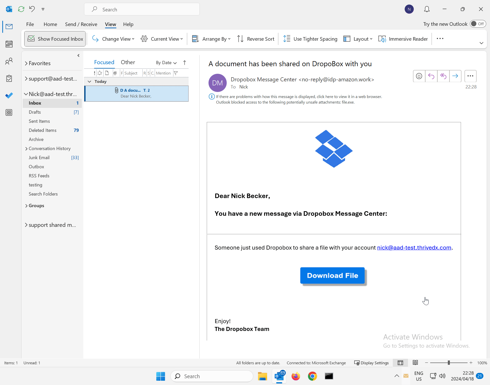

# Attack Templates

### Introduction

Lucy comes with a comprehensive collection of more than 500 attack simulation templates covering various types of attacks. The templates range from straightforward exercises featuring clear spelling mistakes to more intricate simulations involving complex double barrel and file-based attacks. Designed to mimic both real-world scenarios from known brands and hypothetical situations.

***

### Attack Template Variations



This type of simulation targets users' ability to recognize malicious links. It involves crafting emails or messages that include hyperlinks leading to unsafe websites.&#x20;

The goal is to educate users on the dangers of clicking on unknown links and to improve their ability to identify suspicious or malicious hyperlinks.\
\
The attack is deemed successful the moment a user clicks on a hyperlink contained within the simulated email.

<figure><figcaption></figcaption></figure>



This simulation exposes users to scenarios where attackers use compromised or malicious websites to gain access to sensitive information or to infect users' systems with malware. \
\
It teaches users to navigate the web more securely, emphasizing the importance of verifying the legitimacy of websites and the risks of entering personal information into untrusted web pages.\
\
The attack is deemed successful the moment a user enters data on a simulated website landing page.

<figure><figcaption></figcaption></figure>



In this attack type, users are presented with files that appear benign but contain malicious payloads. \
\
These files come in various formats, such as Excel/Word Macros, PDFs, SVG or executables, and are typically distributed via email attachments or landing page downloads.\
\
The objective is to train users to be wary of opening or downloading files from unverified sources and to recognize signs of potentially malicious files.\
\
The attack is deemed successful the moment a user either downloads the file or executes the payload.

<figure><figcaption></figcaption></figure>



Mixed attacks involve a sequence where an email prompts a user to log into a fake portal for credential harvesting.&#x20;

The user then downloads and executes a file, often containing ransomware, as the final success phase of the attack. This simulation trains users to recognize and mitigate multi-step cyber threats, emphasizing the critical need for cautious interaction with emails and websites, and the importance of verifying sources before downloading and executing files.&#x20;

The attack is considered successful when the user executes the ransomware payload.



This attack type involves the use of physical media devices, such as USB drives or [Rubber Ducky's](https://shop.hak5.org/products/usb-rubber-ducky), that are infected with malware. \
\
It aims to educate users about the risks associated with connecting unknown or unsolicited portable media to their devices.&#x20;

The focus is on raising awareness of the potential for these devices to bypass network security measures and directly introduce malware into systems.\
\
The attack is deemed successful the moment a user either runs an executable from a USB or inserts a Rubber Ducky with the potential to act as a keylogger.



***

### Attack Template Directory Navigation

Accessing **Templates -> Attack Templates** displays all the attack templates available on your current server. You can view your **installed** templates as well as browse for templates to **download**.

<figure><figcaption></figcaption></figure>

***

### **Filtering**

With Lucy's extensive template repository, using filters is advantageous to identify which templates are automatically translated into your preferred languages, relevance to your target audiences, category, or difficulty level.



The language filter displays all templates available in the chosen languages. Initially, only a subset of 10 languages is shown by default.

<figure><figcaption></figcaption></figure>

To locate languages not listed, utilize the language search bar.

<figure><figcaption></figcaption></figure>



The type filter enables you to categorize and view all attacks by their predefined attack type. For instance, selecting the filter for Hyperlink attacks will display all the templates associated with this specific type of attack.\

<figure><figcaption></figcaption></figure>


For comprehensive instructions on Attack Types, please refer to our guide titled "[Attack Types](../../guides/attack-simulations/attack-types/)"




The target audience filter helps you find all attack templates relevant to the specific group within your organization you are aiming to train or evaluate. Some attacks are tailor-made for technical staff like developers or system administrators, while others are suited for corporate users, including C-level executives.

<figure><figcaption></figcaption></figure>



The category filter helps you refine your search to attack templates based on their fundamental attack objective. For instance, choosing Social Media as a category will show all templates related to platforms such as Facebook, Twitter, WhatsApp, and others.

<figure><figcaption></figcaption></figure>



The difficulty filter organizes attack templates by their perceived complexity. For instance, templates featuring intentional spelling mistakes and minor branding alterations might be classified as "Low Level," indicating they are easier to identify by the end user. Conversely, templates that include nearly identical landing pages designed to mimic legitimate entities, such as Microsoft, are categorized as "High Level," reflecting their greater challenge in detection.

<figure><figcaption></figcaption></figure>


By default, templates are not assigned a Difficulty level since this classification can be subjective and dependent on the security posture of the organization in question. Manual classification is required during the template editing process to reflect an organization's specific security considerations.




***

### **Search, Actions, and Sorting**

The upper bar in the template directory offers functionalities such as search, the ability to perform actions specific to templates, and options to sort the displayed results.

<figure><figcaption></figcaption></figure>



The Search bar functions as a global search tool, allowing you to retrieve all templates that match your specified keywords.

<figure><figcaption></figcaption></figure>



* **Copy**: Duplicate the selected template within the directory.
* **Restore**: Import a previous Backup template.
* **Backup**: Create a save point for the selected template to preserve its current state as a downloadable backup.
* **Delete**: Permanently remove the selected template from the directory.

<figure><figcaption></figcaption></figure>



By default, templates are sorted from newest to oldest. However, you can choose to sort them alphabetically, by the date they were added, or by the date they were last customized.

<figure><figcaption></figcaption></figure>



This display toggle allows you to switch between viewing the template results as tiles or in a list format.

<figure><figcaption></figcaption></figure>

Tiles:

<figure><figcaption></figcaption></figure>

List:

<figure><figcaption></figcaption></figure>



Starting in Lucy version 5.1 you may select your favorite templates and use the "Starred" filter option to view them:

<figure><figcaption></figcaption></figure>


Click the :star: icon on any template to favorite or unfavorite it.




***


Ready to edit a template? See our guide to [customize an attack template](../../guides/attack-simulations/attack-template-customization.md).


***
