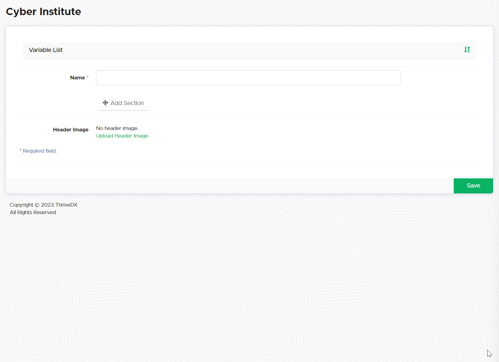
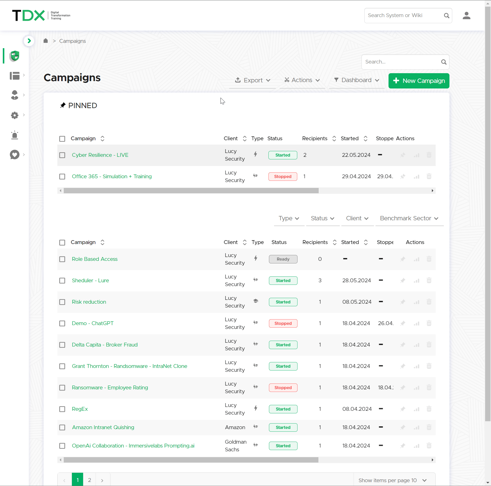

# Report Templates

### Introduction

LUCY comes with predefined report templates called "Phishing Report Template". You can edit these existing templates or create a new one to suit your needs. The template contains sections that can be freely edited, and these sections can be used later in PDF, HTML, or Word reports [generated within a campaign](../campaigns/campaign-settings/results/reports.md).

***

### Configuration


Navigate to **Templates -> Report Templates**


<figure><figcaption></figcaption></figure>


Please note, Report Template v3.0 may only be customized in Lucy version 5.1 or greater.




Select this option to create a completely new report template. Provide a name and start creating each section for your custom report.

<figure><figcaption></figcaption></figure>

After creating your sections, you can start writing the information for each section using the dedicated content editor.

<figure><figcaption></figcaption></figure>



This option allows you to delete pre-selected campaign reports.



This option allows you to create a duplicate of the selected report. It is useful for taking a different approach or making minor changes to a baseline report to suit a new customer.



This option exports your report template as a .tar.gz archived file. This allows you to restore the template on any other Lucy server.



This option allows you to restore a report template from a backup or a different Lucy server.



***

### Editing Report Templates

1.  **Edit Existing Template**:

    * Select the "Phishing Report Template" or any other template you wish to edit.
    * Modify the sections as needed, including changing titles, adding your logo, and customizing content.

2. **Create a New Template**:
   * Click the "New" button to create a new template.
   * Add and customize sections as required.
   * Save the new template for use in your campaigns.

#### Adding Sections and Customizing Templates

* **Sections**: You can add your own sections to the template. Each section can be freely edited to include specific content, variables, and formatting.
* **Title and Logo**: Customize the title of the report and add your own logo to personalize the template.

<figure><figcaption></figcaption></figure>

#### Using Variables in Report Templates

LUCY provides a growing list of variables that act as placeholders for specific statistics or graphics. These variables can be inserted into the content of any report chapter. When the report is generated within a campaign, these variables will be populated with your specific campaign statistics, similar to the graphics in the dashboard.

All available Report Variables

**Report Metadata**:

* `%report.createdate%` - Create Date Of Report
* `%report.author%` - Author Of Report

**Campaign Details**:

* `%startdate%` - Start Date & Time Of Campaign
* `%finishdate%` - Finish Date & Time Of Campaign
* `%creator%` - User Who Created The Campaign

**Campaign Statistics**:

* `%file.formats%` - File-Based Attacks: Name Of File Formats Used In Campaign Scenarios
* `%scenarios.number%` - Number Of Scenarios Used In Campaign
* `%scenarios.names%` - Names Of Scenarios Used In Campaign
* `%scenarios.types%` - Types Of Scenarios Used In Campaign

**Client Information**:

* `%client%` - Client Name

**Email Statistics**:

* `%opened%` - Percentage Of Opened Mail
* `%opened.count%` - Number Of Emails Opened
* `%clicked%` - Percentage Clicked On Link
* `%clicked.count%` - Number Of Emails Clicked
* `%sent.count%` - Number Of Emails Sent
* `%reported%` - Percentage Of Users Reported
* `%success%` - Percentage Of Emails Submitted Data
* `%success.count%` - Number Of Emails Submitted Data

**Additional Statistics**:

* `%domains%` - Domain(s) Used In Scenario Settings
* `%timezone%` - Timezone Setting
* `%recipients.groups%` - Recipient Group Names In Campaign
* `%awareness.names%` - Name Of Awareness Template Used
* `%awareness.sent%` - Number Of Awareness Emails Sent
* `%awareness.opened%` - Number Of Awareness Emails Opened
* `%awareness.incomplete%` - Number Of Users With Incomplete Training
* `%awareness.completed%` - Number Of Users Who Completed Training

**Quiz and Training Statistics**:

* `%questions.number%` - Number Of Questions In Quiz
* `%data.number%` - Absolute Number & Relative Number Of Collected Data From Users

**Incident Reports**:

* `%recipient.count%` - Number of recipients
* `%incident.count.campaign%` - Number of incident reports in campaign
* `%incident.count.campaignrelated%` - Number of all campaign-related reports in total
* `%incident.count.notcampaignrelated%` - Number of all reports not related to campaigns
* `%incident.count.total%` - Number of incident reports total
* `%out.of.office%` - Percentage 'Out Of Office' Responses
* `%bounced%` - Percentage Bounced Messages
* `%responded%` - Percentage Responded Recipients

**Visual Elements**:

* `%logo%` - Logo
* `%table.contents%` - Table Of Contents
* `%system.info%` - System Information
* `%file.settings%` - File-Based Attacks: Settings Table
* `%scenarios.settings%` - Scenarios Settings
* `%scenarios.filebased.settings%` - File-Based Scenarios Settings
* `%message.settings%` - Message Template Settings
* `%schedulers%` - Scheduler Settings
* `%awareness.settings%` - Awareness Website Settings
* `%data%` - Reports the file attack output & forms POST data
* `%additional.fields%` - List Of Available Recipient Fields
* `%victim.table%` - Detailed Victim Results
* `%victim.table.opened%` - The list of victims who opened the email
* `%victim.emails%` - Table of recipient email addresses
* `%victim.table.osbrowsers%` - Browser and OS stats table
* `%victim.table.trainingstats%` - Table With Columns: "Email", "Trained", "Trained At", "Answers Count", "Correct Answers", "% Of Correct Answers"
* `%victim.table.successclickrate%` - Table Columns: "Email", "Succeeded", "Succeeded At", "Success Rate", "Click Rate"
* `%victim.table.mailstats%` - Table Columns: "Email", "Email Opened", "Mail Submitted At", "Clicked", "Clicked At"

**Quiz**:

* `%quiz%` - Quiz Questions

**Analysis and Benchmarking**:

* `%analyse.stats%` - Analyse Statistics
* `%benchmark.stats%` - Benchmark Statistics
* `%compare.stats%` - Campaign Comparison Statistics
* `%trends.stats%` - Trends Stats
* `%timeline%` - Campaign Timeline

**Scenarios and Success Actions**:

* `%scenarios.table.successaction%` - Scenarios Success Action Table

**Charts**:

* `%charts%` - All Charts
* `%charts.summary%` - Summary Chart
* `%charts.totalstats%` - Total Stats Chart
* `%charts.analyse%` - Analyse Stats Chart
* `%charts.awarenesstime%` - Awareness Time Chart
* `%charts.scenariotime%` - Scenario Time Chart
* `%charts.scenariostats%` - Scenario Stats Chart
* `%charts.dailystats%` - Daily Stats Chart
* `%charts.hourlystats%` - Hourly Stats Chart
* `%charts.responses%` - Responses Detection Chart
* `%charts.events%` - Events Chart
* `%charts.os%` - Operating System Chart
* `%charts.browsers%` - Browsers Chart
* `%charts.files%` - Files Chart
* `%charts.plugins%` - Plugins Chart
* `%charts.countries%` - Countries Chart
* `%charts.awareness%` - Awareness Stats Chart
* `%charts.clickstats%` - Click in First 8 Hours Chart
* `%charts.awarenessclicks%` - Awareness Website Clicks Chart
* `%charts.additional%` - Additional Charts
* `%charts.custom%` - Custom Fields Charts
* `%charts.stafftype%` - Staff Types Chart
* `%charts.location%` - Locations Chart
* `%charts.division%` - Divisions Chart
* `%charts.comment%` - Comments Chart
* `%charts.reports%` - Percentage reported/not-reported Chart
* `%charts.reportdynamics%` - Reports Dynamics Over Time
* `%charts.quizquestions%` - Awareness Quiz Questions Chart
* `%charts.quizscores%` - Awareness Quiz Scores Chart
* `%charts.quiztimes%` - Awareness Quiz Times Chart

**Domain and User Tables**:

* `%domains.table%` - Domain list (table with columns: "Domain", "Associated scenario")
* `%users.table%` - Campaign responsible users (table with columns: "User", "User type")
* `%recipient.group.table%` - Recipient groups (table with columns: "Group", "Number of users in this group")
* `%recipient.group.extendedtable%` - Recipient group to scenario association (table with columns: "Name", "Scenario", "Mapping", "Recipients")
* `%recipient.group.customfields.table%` - Recipient settings (table with columns: "Group Name", "Fields", "Values")
* `%campaign.scenarios.table%` - Table of scenarios for the campaign (table with columns: "Scenario Name", "Scenario Type")

**Screenshots**:

* `%awareness.website%` - All Awareness Website Screenshots
* `%awareness.website.table%` - All Awareness Website Screenshots Table
* `%awareness.mail%` - All Awareness Email Template Screenshots
* `%message.screen%` - All Message Template Screenshots
* `%landing.screen%` - All Landing Page Screenshots
* `%landing.screen.table%` - All Landing Page Screenshots Table
* `%message.screen#%` - Message Template Screenshot (# - replace to scenario ID)
* `%landing.screen#%` - Landing Page Screenshot (# - replace to scenario ID)

**Summary Reports**:

* `%summary%` - Summary report across all campaigns for the current client
* `%summary.[type]%` - Summary report across all campaigns by scenario type (\[type] - scenario type, example: `%summary.file%`). List of available scenario types:
  * `%summary.file%` - File-Based
  * `%summary.mixed%` - Mixed
  * `%summary.malware_test%` - Technical Malware Test
  * `%summary.hyperlink%` - Hyperlink
  * `%summary.data%` - Web Based
  * `%summary.awareness%` - Awareness Only
  * `%summary.usb_attack%` - Portable Media Attack
  * `%summary.mail_web_test%` - Mail & Web Test
* `%summary.[period]%` - Summary report across all campaigns by time (\[period] - time period in years or months, example: `%summary.2016-2017%` or `%summary.11.17-12.17%`)

**Worst Performers**:

* `%worst.employees.[limit]%` - Worst employees (\[limit] - number of entries to show, example: `%worst.employees.10%`)
* `%worst.division.[limit]%` - Worst divisions (\[limit] - number of entries to show, example: `%worst.division.10%`)
* `%worst.location.[limit]%` - Worst locations (\[limit] - number of entries to show, example: `%worst.location.10%`)
* `%worst.staff_type.[limit]%` - Worst staff types (\[limit] - number of entries to show, example: `%worst.staff_type.10%`)

***

### Exporting Campaign Data

* **Export using Report Template:**
  * Click on a campaign name, select "Actions" and "Report", and define your export settings.

<figure><figcaption></figcaption></figure>

* **Raw CSV Exports**:
  * Click on a campaign name and you will be able to export all data to a raw CSV from the "Export" drop down menu.

<figure><figcaption></figcaption></figure>

* **Automatic Report Generation**:
  * You can have LUCY automatically create a report and send it to the email address associated with the user who created the campaign. Enable this by clicking the checkbox "After I stop the campaign, send me a report to…" on the [Base Settings](../campaigns/campaign-settings/configuration/base-settings.md#campaign-stop) of the campaign.
  * The report will be emailed as soon as the campaign is stopped.

<figure><figcaption></figcaption></figure>

#### Fetching Report Data via REST API

You can fetch all campaign statistics using LUCY's [REST API](../settings/common-system-settings/api-whitelist/), allowing integration with other systems like your SOC.
