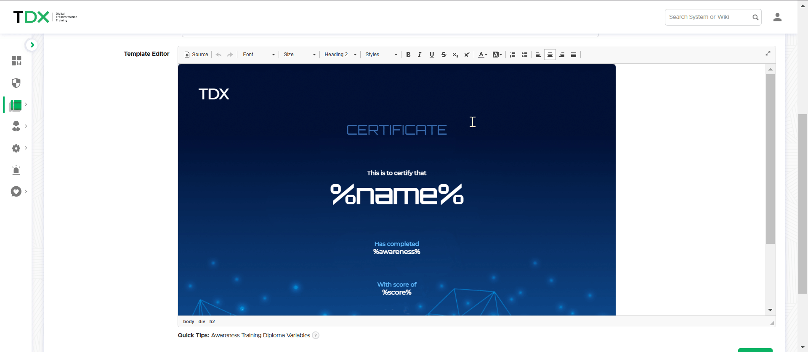

# Training Diploma

Training Diplomas can be emailed to recipients upon successful completion of an awareness training.


Navigate to **Templates -> Awareness Training Diploma**


***

## Diploma Templates

Lucy comes with nine diploma designs ready to use right away, or you can overwrite any of these pre-made templates with your own designs. Each template is comprised of three files:

* **content.html** - the email with the diploma attachment
* **index.html** - the diploma itself
* **style.css** - a stylesheet for the diploma

## Customizing Diplomas

&#x20;To customize a template simply select it and begin editing the content:

<figure><figcaption></figcaption></figure>


You can preview your template to see how it will look to the user with the **Preview** button.


## Template Variables

You can use the following variables to personalize the diploma template:

* `%name%`: the recipient of the diploma
* `%awareness%`: the name of the awareness training
* `%gender%`: the title of the recipient (Mr., Mrs, or no title)
* `%score%`: the recipient's score
* `%date%`: the completion date of the training
* `%time%`: the completion time of the training


These variables are not available in CSS and JavaScript files.

