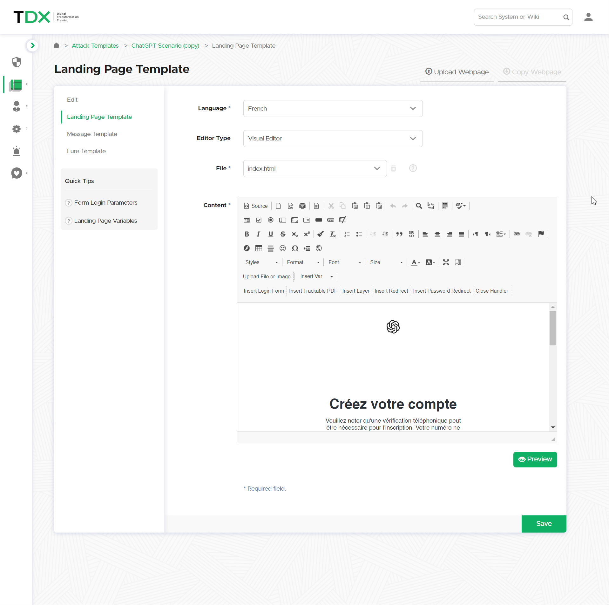

# Attack Template Customization

### Edit an Attack Template


Navigate to **Templates -> Attack Templates**


Lucy offers two workflows for customizing templates: copying and editing an existing template, or starting from scratch with a blank canvas to create a new attack template.

<details>

<summary><strong>Copy an existing template</strong></summary>

Search for the desired template, select the template, click on the Actions drop-down and select Copy.\


\


Please wait while the system creates the copy. The time required may vary depending on the size of the template and could take a few minutes.

Once the copying process is complete, the system will display a green banner indicating "<mark style="color:green;">Finished Successfully.</mark>"

After copying a template, when you search for the template, you'll find the original plus the new copy, which is distinguished by the addition of "(copy)" in the title.\


To edit the copied template, select "Edit Template"

.png>)

</details>

<details>

<summary><strong>Create a New Template</strong></summary>

Select the option for "New Template"

.png>)

The subsequent page will take you to the base settings of the template, where you can define the core components of the template.

.png>)

</details>

We will select an existing template, copy it, and modify it to align with the organization's branding. We'll use the ChatGPT template.

Make a Copy:\


<figure><figcaption></figcaption></figure>

Search for the copied template, select "Edit Template"\


<figure><figcaption></figcaption></figure>

This page serves as the foundation for your template's settings, providing an opportune moment to establish all base parameters.

<figure><figcaption></figcaption></figure>

Once your base settings are defined, click "Save" to commit the changes.


Please note that adding a language does not automatically translate the content; it merely creates an additional folder designated for manual translation into the specified language.


### Attack Message Template

After adjusting the base settings, select "Message Template" in the side panel.

<figure><figcaption></figcaption></figure>

At the top, options are provided to upload your own email template as a .zip file, clear all current attachments, or permanently delete attachments.

<figure><figcaption></figcaption></figure>


**New in Lucy version 5.3!**

Select **Upload .EML** to create an attack template from an email file. With this option you can create training scenarios from real-world phishing emails to better simulate the types of threats your organization faces.




Editing email content is language-specific; changes in one language won't apply to others.


<figure><figcaption></figcaption></figure>



This setting allows you to specify whether the attack is email-based or a smishing (SMS phishing) attack. For detailed instructions on setting up a smishing campaign, please refer to our guide on [smishing](attack-types/smishing.md).



The option shows which language's email template you are currently editing.



This specifies the subject line that recipients will see when they receive the email in their mail client.



Lucy employs a standard open-source visual editor, known as a "What You See Is What You Get" (WYSIWYG) editor, as the default editing tool. For administrators who prefer editing in the source code directly, the "Code Mirror" editor is available as an alternative option.


You can change your default editor in the [Advanced Settings](../../application-screens-reference/settings/advanced-system-settings/advanced-settings.md#default-editor-type)




This is the main editor where you will make adjustments to your email template.



Start with the Subject line by incorporating your company name.

<figure><figcaption></figcaption></figure>

In the email body, strategically place your company name wherever it's relevant to reinforce the impression of a genuine collaboration.

<figure><figcaption></figcaption></figure>


Expand the Visual Editor for easier navigation and template editing.

.png>)


Add your company logo by selecting "Upload file or Image" and choose your logo file to insert at the bottom of the email for enhanced brand recognition and trust.

<figure><figcaption></figcaption></figure>

<details>

<summary>Guide to Uploading File or Image</summary>

Select "Upload file or Image" in the Visual Editor

.png>)

Select "Browse Server" or provide a publicly accessible URL.

.png>)

Select "Upload"

.png>)

Choose your file for upload and wait for the server to confirm a successful upload - Double-click on the uploaded file

.png>)

Upload your image and adjust its size. Keep the aspect ratio lock enabled. Scale the image to a width of 120px to fit nicely into the email layout.

.png>)

Click "Ok" once you are happy with the changes made.

.png>)

Double-click the image in the Visual Editor to open settings and make further adjustments.

</details>

Lucy uses placeholder variables like **%{VALUE}%** to personalize email content for phishing campaigns. This allows Lucy admins to make emails more credible by including details like the recipient's first name, gender, or time-sensitive information.

In this example, the variable **%name%** is included by default, which automatically fetches the recipient's full name from the [imported recipient group](../../application-screens-reference/users/recipient-groups.md) data.

<details>

<summary>Placeholder Variables</summary>

Here are detailed explanations for each variable that can be utilized in the template:

* **%link%**: Generates a unique page URL for the recipient. This can be used to direct users to a specific landing page tailored for the phishing simulation.
* **%link-awareness%**: Provides a link to an awareness website. This variable requires the awareness website to be configured and enabled in the campaign settings beforehand.
* **%qr-code%**: Creates a QR code representing the unique page URL for the recipient. This can be scanned by the recipient's device, directing them to the specified URL.
* **%name%**: Inserts the recipient's full name as provided in the recipient group import, allowing for personalized email content.
* **%firstname%**: Places the recipient's first name into the email, enhancing personalization.
* **%lastname%**: Adds the recipient's last name into the email, further personalizing the message.
* **%email%**: Includes the recipient's email address within the email content.
* **%division%**, **%location%**, **%staff-type%**, **%comment%**: These variables are used to insert recipient-specific information such as their division, location, staff type, or any comments.
* **%gender("MALE ADDRESSING", "FEMALE ADDRESSING", "NO GENDER")%**: Customizes the email content based on the recipient's gender, allowing for gender-specific addressing.
* **%subject%**: Displays the subject of the phishing mail, which can be used within the email content for reference.
* **%sender%**: Indicates the sender's name of the phishing mail, adding authenticity to the message.
* **%sender-email%**: Shows the email address from which the phishing mail is sent.
* **%time(FORMAT, OFFSET, ZONE)%**: Allows for time-based variables within the email.
  * **FORMAT** specifies the date/time format.
  * **OFFSET** is the date/time offset in minutes, which can be positive or negative, adjusting the time displayed relative to the email's submission time.
  * **ZONE** refers to the time zone.
  * Example: `%time("l, H:i", "0", "Europe/Zurich")%` outputs the exact time of email submission in the Europe/Zurich zone (e.g., "Monday, 09:20").
  * Example: `%time("Y/m/d H:i:s", "60")%` shows the time 1 hour ahead of the email submit time.

Please note, these variables cannot be used in CSS and Javascript files.

</details>

Specifying the link within the attack email is crucial. Lucy automatically includes a **%link%** placeholder to use the campaign's domain in the link. If you want to change this link to another word in the email, you can do so:

* Highlight the desired word.
* Choose the "link" option in the visual editor toolbar.
* Alternatively, you can use the keyboard shortcut (Ctrl + L).

<figure><figcaption></figcaption></figure>

Highlighting a word prompts a pop-up to define the link. By default, Lucy inserts the **%link%** placeholder, eliminating the need for further action from the administrator.

<figure><figcaption></figcaption></figure>

***

### Attack Landing Page Template

Modify your attack landing page. Lucy allows administrators to adjust default pages or upload their own. You can also copy a landing page from any target website.

<figure><figcaption></figcaption></figure>


Select your language before making edits. Changes are language-specific and must be made separately for each language.


Understanding landing page structure is key for successful data handling in Lucy. Each attack landing page has two files: **index.html** and **account.html**

<figure><figcaption></figcaption></figure>


**Note:** Do not modify the names of these pages: `index.html` and `account.html`, as they are hardcoded into the system.




`index.html` serves as the login page to which users are directed after clicking the simulated phishing link in their email.

This action is standard in all attack templates. If you replicate a website, ensure you change the form action to `"?login"` to enable the submission of user credentials back to Lucy.

```html
<form action="?login">
```

If you inspect the source code, you will notice the following form action:



`account.html` is the next page after users submit their data successfully.

It's important to keep this page as the attack relies on moving from index.html to account.html.

If you want to indicate that this was a phishing simulation, you can achieve this by redirecting to an awareness page template. See our guide on [redirecting users to an awareness template](redirecting-users.md).



Edit the landing page with the WYSIWYG editor by changing text, dragging components, or uploading custom icons and images.

<figure><figcaption></figcaption></figure>

Once you configure your attack landing page, you can proceed to [bind this attack template to a campaign](../../application-screens-reference/campaigns/new-campaign/).
