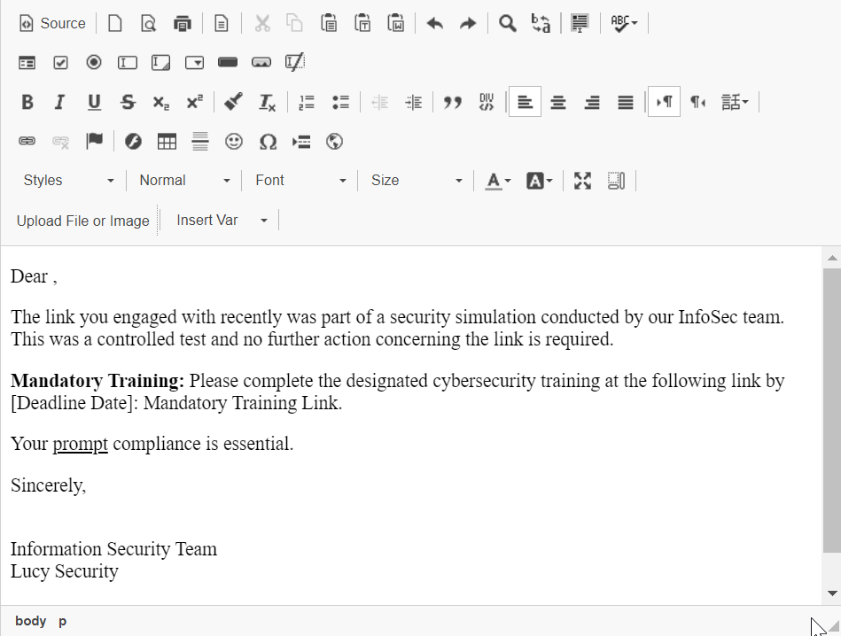

# Awareness Template Customization

## Edit Awareness Template

Lucy provides two main ways to customize templates: you can either copy and edit an existing template or start fresh with a blank canvas to create a new awareness template.

<details>

<summary><strong>Copy an existing template</strong></summary>

Search for the desired template, select the template, click on the Actions drop-down and select Copy.

.png>)

Please wait while the system creates the copy. The time required may vary depending on the size of the template and could take a few minutes.

Once the copying process is complete, the system will display a green banner indicating "<mark style="color:green;">Finished Successfully.</mark>"

After copying a template, when you search for the template, you'll find the original plus the new copy, which is distinguished by the addition of "(copy)" in the title.\


.png>)


To edit the copied template, select "Edit Template"

.png>)

</details>

<details>

<summary>Create a New Template</summary>

Select the option for "New Template"

.png>)

The subsequent page will take you to the base settings of the template, where you can define the core components of the template.

.png>)

</details>


For this guide, we will focus on customizing a **One Pager: Customizable template**


Select "Edit Template" to set key parameters that will improve future data classification and sorting.


Please refer to our [Awareness Template - Platform Reference](../../application-screens-reference/templates/awareness-templates.md) guide for detailed definitions of these parameters.


### Email Template

Customize this default email template to match your organization's branding, font, and style. This email template is used if the "Send link to Awareness website automatically via Email" setting is enabled in your attack scenario.

#### **Accessing the Template**

Navigate to "Email Template".

<figure><figcaption></figcaption></figure>

**Setting Up the Email**

Choose the language from the "Language" dropdown, e.g., English.


Languages don't translate automatically; you need to adapt each selected language manually.


**Email Details**

* Fill in the "Subject" field, e.g., "Phishing training".
* Enter "Sender Name", e.g., "IT Security".
* Provide "Sender Email", e.g., "security@your-company.com".


It's advisable to use a [sender domain ](../../application-screens-reference/settings/common-system-settings/domains/#dns-records-explained)related to your company to create a sense of familiarity, especially since the user was just successfully phished.


**Content Editor**

Choose "Editor Type" from the dropdown to select your preferred email editor.



The Visual Editor is an easy-to-use tool that shows you how your content will look when finished. With a simple toolbar, you can format text and add multimedia without any coding.



The Code Mirror Editor is for users with coding skills. It offers a text editor that highlights code for HTML and CSS, allowing detailed control over how the content looks and is structured.



**Composing the Email**

Use the "Content" section for email composition.

#### Format text with the toolbar options (bold, italic, underline, etc.).

<figure><figcaption></figcaption></figure>

#### Insert dynamic variables into the content.

<figure><figcaption></figcaption></figure>

<details>

<summary>Dynamic Variables Explained</summary>

When creating email templates, use placeholders to personalize content. These placeholders automatically replace with user data upon sending. Below is an explanation of each available variable.:

* `%link%`: This variable represents the base URL of your site. Use it to construct absolute URLs for navigation within your emails.
* `%user-password-reset%`: This placeholder is replaced with the unique URL for a password reset action.
* `%user-profile-link%`: Inserts a direct link to the user's profile page in the End User Portal.
* `%user-login-url%`: Provides a link to the End User Portal that utilizes SSO (OAuth 2.0) for login.
* `%name%`: The full name of the email recipient.
* `%firstname%`: The recipient's first name.
* `%lastname%`: The recipient's last name.
* `%email%`: The recipient's email address.
* `%client%`: The name of the client associated with the recipient.
* `%gender("MALE ADDRESSING", "FEMALE ADDRESSING", "NO GENDER")%`: This is a conditional variable that changes the greeting or addressing based on the recipient's gender.
* `%subject%`: The subject line of the phishing email.
* `%sender%`: The name of the sender of the phishing email.
* `%sender-email%`: The email address from which the phishing email is sent.
* `%started%`: The date when the related phishing campaign was started.
* `%stopped%`: The date when the related phishing campaign was stopped.
* `%time(FORMAT, OFFSET, ZONE)%`: A dynamic time variable where:
  * `FORMAT` refers to the format in which the date/time should be displayed.
  * `OFFSET` is the time offset from the mail send time, which can be positive or negative.
  * `ZONE` is the time zone to be applied.
  * Example: `%time("l, H:i", "0", "Europe/Zurich")%` would display the time of the email submission in the Europe/Zurich time zone.
  * Example: `%time("Y/m/d H:i:s", "60")%` would show a timestamp one hour ahead of the email submission time.

Note that these variables are intended for use in the HTML body of the email and are not applicable within CSS and Javascript files. They serve to customize the email content for each recipient and should be used accordingly to ensure a personalized user experience.

</details>

#### Click "Upload File or Image" to add company branding or assets.

<figure><figcaption></figcaption></figure>

**Save and Preview**

* Click "Save" to store your latest modifications to the email template settings.
* Click "Preview" to review the email.

### Content Template

The Content Template page features a WYSIWYG editor, enabling administrators to adjust and define parameters related to the awareness landing page. In the context of a one-page awareness initiative, this setup offers an excellent opportunity to educate users about what to watch for in the simulated attack they just experienced.

**Export to SCORM**\
This button allows users to export the content they have created as a SCORM package (1.2 / 2004), which is a standard format for e-learning content that can be used with different learning management systems.


When exporting awareness content to an LMS, Lucy won't receive any stats. User progress is handled within the LMS.


**Upload Webpage**\
Click this button to upload a .zip file of your custom HTML for the landing page.


Follow the file naming convention by using "index.html" as the name for your landing page.


**Language**\
Admins use this dropdown to choose the content language, allowing phishing simulations to be localized for different audiences.

**File**\
Admins can select the file they want to edit, such as 'index.html', the main file for the awareness landing page.

**Editor Type**\
Admins can switch between different editors. The 'Visual Editor' is a WYSIWYG tool that lets you edit content easily without knowing HTML.

**Content**\
This is the main area where users create or edit the content of their awareness template.

* **Source Button**: Allows users to switch to the HTML source code view if they need to make changes directly to the HTML.
* **Formatting Toolbar**: Provides a suite of formatting tools, like bold, italic, font size, and color, to style the content.
* **Styles, Format, Font, Size Menus**: These dropdowns provide additional styling options to format the text and content within the editor.
* **Upload File or Image**: This feature lets administrators add images or other files directly into their content.

**Preview**\
The preview button enables administrators to see a live preview of the content as it will appear to the end-user when the awareness training is running.

#### Edit the Content Template

Several elements of the template can be customized to fit your brand, such as the logo, text, and email display options. This guide focuses on the one-page awareness template, which quickly informs users that the email they received was a phishing simulation. It helps reduce panic and offers tips on handling the attack.


Quick tip: Maximize your editor window to simplify the customization process.


<figure><figcaption></figcaption></figure>

#### Preview your template

After applying your desired customizations, remember to click "Save" to commit the changes. You can then preview the template for inspection.

***

### Editing Advanced Awareness Templates

One-page templates need simple changes to the landing page (index.html) via a visual editor.&#x20;

Modifying these templates will require an administrator to access the source code for adaptions to pages and/or Quiz questions. The following guide will look at an advanced awareness template -> **All about Microsoft 365**


If you need help customizing your templates, please [contact our support](../../when-to-contact-us/contact-technical-support.md) department, and they will create a ticket with our content team to assist you.


#### Cosmetic changes to the template

Administrators can update the logo on the landing page (index.html) to change it for all training pages.

<figure><figcaption></figcaption></figure>

#### Changing the color scheme

To change the default color scheme, access the "style.css" file in the "All about Microsoft 365" template.

<figure><figcaption></figcaption></figure>

If you preview and inspect the default template using Developer Tools in your browser, you will be able to identify the related elements.

<figure><figcaption></figcaption></figure>

#### Editing lesson content

Each lesson in your template has a corresponding page in the file system.

<figure><figcaption></figcaption></figure>

To quickly identify the HTML file for a page, open index.html in a new tab and use the browser's Developer Tools to find the associated numerical value.

<figure><figcaption></figcaption></figure>

#### Editing the Exam questions

The exam question bank is located in the Lucy file system named exam.js. You can simply navigate to the exam.js file, and search for any keyword in the above question using your browsers search function:

<figure><figcaption></figcaption></figure>

This section enables you to modify the questions and/or answers. You can also indicate which answer is correct based on the numerical value associated with each answer.

```
{ //13
        question: "",
        question2: "Your PC at home is “behaving” strangely and you urgently need to finish a document for work. You are not allowed to:",
        answer: 4,
		type: "radio",
        answers: [
			"Go back to the office and finish the document on the work PC.",
			"Take the business PC home to finish the document.",
			"Edit the document on your private device, because if you have malware, you will find out, at the latest, when you open the document at work.",
			"Inform your supervisor and complete the document as quickly as possible the next day."
        ],
        remark: ""
	},
```
